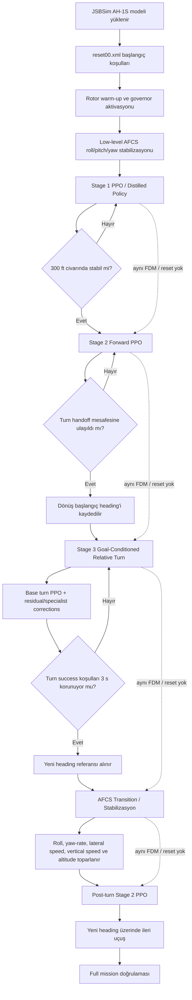

# AH-1S JSBSim Reinforcement Learning Uçuş Kontrol Projesi

Bu proje, **JSBSim içindeki `ah1s` helikopter modelini** kullanarak AH-1S için çok aşamalı bir uçuş görevinin **PPO tabanlı reinforcement learning (RL)**, **teacher–student / policy distillation**, **residual düzeltmeler** ve **AFCS destekli geçiş kontrolü** ile gerçekleştirilmesini amaçlar.

Temel görev zinciri:

> **Stage 1: Kalkış ve 300 ft hover → Stage 2: İleri uçuş → Stage 3: Relative turn → Transition: Dönüş sonrası stabilizasyon → Post-turn Stage 2: Yeni heading üzerinde ileri uçuş**

En önemli tasarım kararı, fazlar arasında simülasyonun yeniden başlatılmamasıdır. **Aynı JSBSim FDM (Flight Dynamics Model) ve aynı helikopter state’i bir sonraki faza aktarılır.** Böylece her policy yalnızca ideal bir başlangıç durumunda değil, önceki fazın gerçek dinamik çıktısı üzerinden çalışır.

> Bu repository bir **simülasyon / araştırma projesidir**. Buradaki action mapping, trim değerleri ve kontrol mantıkları JSBSim modeline yöneliktir; gerçek AH-1S uçuş kontrol sistemi için operasyonel talimat değildir.

---

# 1. Repoyu ilk açan kişi ne yapmalı? — Önerilen çalışma sırası

Bu bölüm, repository’yi ilk kez açan kişinin **hangi dosyayı neden çalıştıracağını** netleştirir.

## 1.1. Repository’yi al ve bağımlılıkları kur

```bash
git clone https://github.com/selincyr/ah1s-rl-project.git
cd ah1s-rl-project
pip install -r requirements.txt
```

Google Colab kullanılıyorsa repository zaten klonlanmışsa:

```bash
%cd /content/ah1s-rl-project
!git pull --rebase origin main
!pip install -r requirements.txt
```

### Colab içinde canlı target-heading dashboard

`run_colab_live_heading_dashboard.py`, Gradio/Hugging Face veya localhost
kullanmadan doğrudan Colab hücresinin içinde çalışır. Stage 1'den itibaren aynı
JSBSim FDM'i korur; kullanıcı çalışma devam ederken `0–359°` absolute target
heading girer. 3D rota, top view, altitude profile ve telemetri gerçek simülasyon
state'i ile canlı güncellenir.

```python
%cd /content/ah1s-rl-project
%run run_colab_live_heading_dashboard.py
```

Panelde `FORWARD / READY` görüldüğünde `Target Heading` alanına değer girilip
`Fly to Heading` düğmesine basılır. Sistem komut başladığı andaki current heading
ile hedef arasındaki en kısa relatif dönüşü hesaplar. Örneğin `350° -> 10°`,
`+20°` komutuna çevrilir.

`requirements.txt` içindeki temel paketler:

```text
stable-baselines3
gymnasium
numpy
matplotlib
jsbsim
```

## 1.2. Önce proje yapısını anla — bunlar doğrudan “çalıştırılacak” dosyalar değildir

İlk okunması gereken çekirdek dosyalar:

```text
helicopter_env_v2.py
    Temel AH-1S / JSBSim environment katmanı.
    Root dosya, korunmuş gerçek implementasyonu deneme/helicopter_env_v2.py içinden yükler.

helicopter_env_stage1_distill.py
    Stage 1: takeoff + 300 ft hover + teacher/student distillation mantığı.

helicopter_env_stage2_refine_mapped.py
    Stage 2: forward flight ve dört action’ın fiziksel mapping’i.

helicopter_env_turn_goal.py
    Stage 3: goal-conditioned relative-turn environment.

helicopter_env_turn_goal_full_entry.py
    Turn policy’yi Stage 1 → Stage 2 sonrasındaki gerçek giriş state’leri ile test eden katman.
```

Bu environment dosyaları **ana giriş noktası değildir**. Bunların görevi state, observation, action mapping, reward, safety ve JSBSim fizik bağlantısını tanımlamaktır.

## 1.3. Stage 1’i tek başına doğrula

Stage 1’in görevi:

```text
rotor hazır
→ kalkış
→ 300 ft’e çıkış
→ vertical speed’i azaltma
→ stabil hover
```

Stage 1 için kullanılan temel model:

```text
AH1S_STAGE1_FINAL_DISTILLED.zip
```

Eski standalone Stage 1 runner’ı model dosyasını şu klasörde bekler:

```text
models_stage1_final_distilled/AH1S_STAGE1_FINAL_DISTILLED.zip
```

Fresh clone’da model root’ta bulunuyorsa önce beklenen klasöre kopyalanabilir:

```bash
mkdir -p models_stage1_final_distilled
cp AH1S_STAGE1_FINAL_DISTILLED.zip models_stage1_final_distilled/AH1S_STAGE1_FINAL_DISTILLED.zip
python deneme/stage1_live_simulation.py
```

Bu testin amacı **yalnızca Stage 1’in 300 ft takeoff/hover davranışını görmek**tir. Burada full mission çalıştırılmaz.

## 1.4. Stage 2 için ne yapılmalı?

Final Stage 2 modeli:

```text
models_stage2_hybrid_final/AH1S_STAGE2_HYBRID_FINAL.zip
```

Stage 2’nin görevi yaklaşık 300 ft irtifayı korurken kontrollü ileri uçuş üretmektir.

Normal kullanıcı için `build_stage2_hybrid_final.py` **ilk çalıştırılacak dosya değildir**; bu dosya Stage 2 modelini yeniden üretmek/eğitmek için hazırlanmış ağır bir build-training pipeline’ıdır.

Stage 2, turn robustness ve full-mission validator’larında zaten gerçek Stage 1 handoff’u sonrasında otomatik olarak kullanılır. Bu nedenle yalnızca mevcut final sistemi görmek isteyen kişi Stage 2’yi yeniden eğitmemelidir.

## 1.5. Turn modellerinin varlığını kontrol et

Güncel V22 turn runtime stack’i aşağıdaki checkpoint’lere ihtiyaç duyar:

```text
models_turn_hybrid/AH1S_TURN_HYBRID_V5_COLLECTIVE_ONLY.zip
models_turn_hybrid/AH1S_TURN_FULL_ENTRY_V4_RESIDUAL_ADAPTER.pt
models_turn_hybrid/AH1S_TURN_FULL_ENTRY_V7_GATED_200_PATCH.pt
models_turn_hybrid/AH1S_TURN_FULL_ENTRY_V17_ROBUST_50_PATCH.pt
models_turn_hybrid/AH1S_TURN_FULL_ENTRY_V21_STRONG_TERMINAL_50_PATCH.pt
```

Kontrol:

```bash
python - <<'PY'
from pathlib import Path
paths = [
    "models_turn_hybrid/AH1S_TURN_HYBRID_V5_COLLECTIVE_ONLY.zip",
    "models_turn_hybrid/AH1S_TURN_FULL_ENTRY_V4_RESIDUAL_ADAPTER.pt",
    "models_turn_hybrid/AH1S_TURN_FULL_ENTRY_V7_GATED_200_PATCH.pt",
    "models_turn_hybrid/AH1S_TURN_FULL_ENTRY_V17_ROBUST_50_PATCH.pt",
    "models_turn_hybrid/AH1S_TURN_FULL_ENTRY_V21_STRONG_TERMINAL_50_PATCH.pt",
]
for p in paths:
    print("VAR" if Path(p).exists() else "YOK", p)
PY
```

**Önemli:** Bu turn checkpoint’leri fresh clone’da yoksa V22/full-mission testleri çalışmaz. Böyle bir durumda önce doğrulanmış checkpoint backup’ları `models_turn_hybrid/` altına geri konmalıdır. Sadece dosya eksik diye doğrudan training scriptlerini yeniden çalıştırmak doğru başlangıç yöntemi değildir; aynı isimde yeni eğitim yapmak eski doğrulanmış ağırlıkları birebir geri getirmez.

## 1.6. Turn sistemini doğrula — önerilen ana turn testi

Checkpoint’ler hazırsa ilk gerçek turn doğrulaması:

```bash
python test_turn_full_entry_v22_v21_runtime.py
```

Bu dosya şu stack’i test eder:

```text
Stage 1 handoff
→ Stage 2 forward entry
→ fiziksel randomized entry
→ V5 base turn PPO
→ V4 live-entry residual
→ +200° için V7 gated patch
→ +50° için V17 + V21 terminal correction
→ success / safety kontrolü
```

Doğrulanmış V22 koşusunda hedefler:

```text
-50°
+50°
+200°
+360°
```

5 farklı fiziksel giriş varyasyonu ile toplam **20/20 PASS, 0 safety failure** elde edilmiştir.

Bu yüzden turn tarafını anlamak isteyen biri için **ilk çalıştırılması gereken ana test dosyası `test_turn_full_entry_v22_v21_runtime.py`**’dir.

## 1.7. Full mission nasıl çalıştırılır?

Full mission şu sırayı aynı JSBSim FDM üzerinde yürütür:

```text
Stage 1
→ Stage 2
→ Relative Turn
→ AFCS Transition
→ Post-turn Stage 2
```

Güncel reconstructed sistemde full-mission kanıtı hedef açı bazında birkaç targeted validator’a dağılmıştır. Önemli güncel runner’lar:

```bash
# -50° için güncel başarılı transition/post-turn düzeltmesi
python run_targeted_regression_v29_neg50_transition_raw_patch.py

# +200° için güncel başarılı post-turn tuning
python run_targeted_regression_v27b_post_turn_tuning.py
```

`+50°` ve `+360°` için de güncel reconstructed stack ile PASS elde edilmiştir; ancak repository tarihindeki V24/V25/V27/V29 dosyaları farklı hedefleri düzeltmek için ardışık targeted sürümlerdir.

**Şu an için önemli not:** `run_final_regression_v23.py` tarihsel 4/4 sonucu temsil eden eski zincirdir. Sonradan turn ağırlıkları yeniden kurulduğu için bunu “mevcut reconstructed modellerin tek unified final testi” olarak yorumlamayın. Güncel durumda tüm dört hedef için ayrı PASS kanıtı vardır, fakat tek bir latest-config unified 4/4 runner ayrıca birleştirilmelidir.

## 1.8. İnteraktif replay oluştur

Full-mission telemetry hazırlandıktan sonra görselleştirme tarafında kullanılan dosyalar:

```text
build_final_interactive_replay.py
build_interactive_replay_3d_dashboard.py
beautify_current_full_mission_replay.py
```

Örneğin 3D dashboard:

```bash
printf "50\n" | python build_interactive_replay_3d_dashboard.py
```

Replay’in amacı:

```text
Stage 1 — Takeoff / Hover
Stage 2 — Forward Flight
Stage 3 — Relative Turn
Transition — AFCS Stabilization
Post-turn — Stage 2 PPO
```

fazlarını Play/Pause, scrub slider ve canlı telemetry ile izlemektir.

Replay **policy değildir**; gerçek simülasyon telemetry’sini görselleştirir.

## 1.9. İlk açılışta çalıştırılmaması gereken dosyalar

Aşağıdaki dosyalar çoğunlukla eğitim, repair, calibration veya tarihsel deney içindir:

```text
build_stage2_hybrid_final.py
build_stage3_hybrid_final_v3.py
build_turn_hybrid_v1.py
repair_turn_*.py
train_turn_*.py
calibrate_*.py
make_v13_from_v7.py
deneme/diagnose_*.py
```

Amaç sadece çalışan final sistemi görmekse **bunlarla başlanmaz**. Bunlar model yeniden üretimi, tanılama veya geliştirme geçmişi için kullanılır.

### Kısaca önerilen kullanıcı akışı

```text
1. pip install -r requirements.txt
2. Stage 1 standalone kontrolü
3. Turn checkpoint’lerini doğrula
4. test_turn_full_entry_v22_v21_runtime.py
5. Gerekirse güncel targeted full-mission validator
6. Interaktif replay
```

---

# 2. Genel algoritma akışı



Runtime veri akışı:

```text
JSBSim state
    ↓
Observation vector
    ↓
Aktif fazın PPO / control policy'si
    ↓
Normalized action [-1, 1]
    ↓
Physical control mapping
    ↓
collective / longitudinal cyclic / lateral cyclic / pedal
    ↓
JSBSim physics step
    ↓
Yeni state + reward + safety kontrolleri
```

---

# 3. AH-1S ve simülasyon tarafı

Projede gerçek uçuş donanımı yerine **JSBSim flight dynamics engine** ve JSBSim’in `ah1s` modeli kullanılmaktadır.

Temel ayarlar:

```text
JSBSim model     : ah1s
Initial condition: reset00.xml
Physics timestep : 0.0075 s
Physics/action   : 10 step
RL control dt    : ~0.075 s
Control frequency: ~13.33 Hz
Target altitude  : ~300 ft AGL
```

Rotor başlangıçta warm-up sürecinden geçirilir ve governor aktif hale getirilir. Roll, pitch ve yaw için AH-1S modelinin AFCS kanalları low-level stabilizasyon amacıyla kullanılabilir. Stage 1’in temel yaklaşımında altitude kontrolü AFCS’ye bırakılmaz; irtifa davranışı PPO tarafından öğrenilir.

---

# 4. Action space ve helikopter kontrol eksenleri

Policy’nin temel action vektörü dört boyutludur:

```python
Action = [a0, a1, a2, a3]
```

Tüm PPO action’ları normalize edilir:

```text
-1.0 <= action[i] <= +1.0
```

| Action | JSBSim kontrolü | Helikopter karşılığı | Temel etkisi |
|---|---|---|---|
| `a0` | Collective | Collective | Rotor toplam pitch/thrust; climb/descent/altitude |
| `a1` | Elevator | Longitudinal cyclic | Pitch ve ileri–geri hareket |
| `a2` | Aileron | Lateral cyclic | Roll ve lateral hareket |
| `a3` | Rudder | Pedal / yaw | Yaw ve heading |

`elevator`, `aileron` ve `rudder` isimleri JSBSim FCS property adlarıdır; helikopter açısından longitudinal cyclic, lateral cyclic ve pedal/yaw davranışını temsil edecek şekilde kullanılır.

## Stage 1 mapping

İlk Stage 1 geliştirmesinde PPO yalnızca collective üzerinde aktifti:

```text
a0 = -1 → collective ≈ 0.590
a0 =  0 → collective ≈ 0.620
a0 = +1 → collective ≈ 0.650
```

```python
collective = 0.620 + 0.030 * a0
```

Daha sonraki distilled Stage 1 sürümünde student dört action üretir; cyclic ve pedal komutları hover trim değerleri etrafında sınırlı authority ile uygulanır ve smoothing yapılır.

## Stage 2 mapping

Stage 2’de collective ve longitudinal cyclic ileri uçuş için aktiftir. Lateral/yaw mapping fiziksel residual olarak uygulanır:

```text
a2 → mevcut aileron trim + 0.026 * a2
a3 → mevcut rudder  trim + 0.040 * a3
```

## Stage 3 turn mapping

```python
collective = clip(0.540 + 0.080 * a0, 0.460, 0.620)
elevator   = clip(-0.145 + 0.035 * a1, -0.180, -0.110)
aileron    = clip(0.19095 + 0.300 * a2, -1.0, 1.0)
rudder     = clip(0.39000 + 0.500 * a3, -1.0, 1.0)
```

Turn fazında lateral/yaw authority Stage 2’ye göre daha geniştir; çünkü policy gerçek bir yön değiştirme manevrası üretir.

---

# 5. Observation space

Temel observation yalnızca altitude değildir; translational ve rotational state birlikte kullanılır.

Temel 12 özellik:

| İndeks | Gözlem |
|---|---|
| 0 | Altitude error |
| 1 | Altitude |
| 2 | Vertical speed |
| 3 | Forward velocity |
| 4 | Lateral velocity |
| 5 | Pitch |
| 6 | Roll |
| 7 | Roll rate `p` |
| 8 | Pitch rate `q` |
| 9 | Yaw rate `r` |
| 10 | Heading error |
| 11 | Rotor RPM error |

Stage 1 distillation environment’ında:

```text
12 base feature
+ north
+ east
+ north velocity
+ east velocity
+ heading error
+ yaw rate
= 18 feature
```

Relative-turn environment’ında:

```text
12 Stage-2 feature
+ target_turn / 360
+ remaining_turn / 360
+ cumulative_turn / 360
+ direction
= 16 feature
```

Bu nedenle turn policy hem helikopterin mevcut durumunu hem de **hangi açı kadar dönmesi gerektiğini** bilir.

---

# 6. Stage 1 — Takeoff ve 300 ft hover

```text
motor / rotor hazır
→ takeoff
→ 300 ft’e climb
→ vertical speed’i azalt
→ 300 ft civarında stabil hover
```

Teacher–student distillation sırasında teacher action’ları eğitim scaffold’u olarak kullanılmıştır. Final runtime’da teacher kapalıdır.

Stage 1 tamamlandığında helikopter resetlenmez; altitude, velocity, attitude, angular rate, heading ve rotor state aynı FDM üzerinde Stage 2’ye aktarılır.

---

# 7. Stage 2 — Forward flight

Stage 2’nin amacı yaklaşık 300 ft irtifayı korurken kontrollü ileri uçuş üretmektir.

Reward bileşenlerinin ana mantığı:

- forward progress için pozitif reward,
- altitude error cezası,
- vertical speed cezası,
- hedef forward speed’den sapma cezası,
- lateral drift cezası,
- pitch/roll cezası,
- action smoothness cezası.

Standalone training environment’ında hedef forward distance 300 ft’dir. Full-mission turn handoff’unda ise yaklaşık **160 ft forward flight** sonrası turn entry oluşturulur.

---

# 8. Stage 3 — Relative turn

Relative turn, dönüşün başladığı andaki heading’i referans alıp verilen açı kadar dönmektir.

Örnek:

```text
Başlangıç heading = 180°
Relative command  = +50°
Yeni yön          ≈ 230°
```

Projedeki işaret konvansiyonu:

```text
+ açı → sağa / saat yönünde
- açı → sola / saat yönünün tersine
```

`+360°` gibi manevralarda başlangıç ve bitiş heading’i aynı görünebilir. Bu yüzden yalnızca final heading karşılaştırılmaz; her step’te heading farkı unwrap edilerek **cumulative turn** tutulur:

```python
remaining_turn = requested_turn - cumulative_turn
```

## Turn success kriterleri

```text
|remaining turn| <= 1.5°
|roll|          <= 4°
|yaw rate|      <= 6°/s
285 ft <= altitude <= 315 ft
|vertical speed| <= 1.5 ft/s
forward speed >= 8 ft/s
```

Bu koşullar yaklaşık **3 saniye boyunca** korunmalıdır.

Safety sınırlarından bazıları:

```text
altitude < 275 ft veya > 325 ft
|roll| > 18°
|pitch| > 15°
|yaw rate| > 30°/s
forward speed < 1 ft/s
JSBSim failure
```

---

# 9. Turn policy stack’i

Final turn yaklaşımı tek bir modelden ibaret değildir:

```text
Base turn PPO
    +
Live-entry residual adapter
    +
Hedefe özel gated patch
    +
Gerekirse terminal correction
    ↓
Final action
    ↓
clip [-1, +1]
    ↓
JSBSim
```

Güncel doğrulanmış turn zincirinde temel roller:

```text
V5  → base turn PPO
V4  → live-entry residual adapter
V7  → +200° gated correction
V17 → +50° robust correction
V21 → +50° terminal correction
```

Residual modeller ana policy’nin öğrendiği davranışı tamamen değiştirmek yerine belirli problemli state bölgelerinde küçük düzeltmeler üretir.

---

# 10. Teacher–Student / Policy Distillation

Teacher final runtime controller değildir.

Training mantığı:

```text
State
 ├──→ Teacher → reference/target action
 └──→ Student PPO → predicted action

training scaffold / distillation
        ↓
student daha fazla authority alır
        ↓
teacher blend azaltılır
        ↓
teacher OFF
```

Final görev:

```text
Teacher = OFF
Student / learned policy = ON
```

Teacher ağırlıkları runtime’da student’a aktarılmaz. Teacher eğitim sırasında hedef davranış/action sağlayan bir scaffold’dur. Reward ise görev hedefleri ve fiziksel hata metriklerinden ayrıca hesaplanır.

---

# 11. Transition neden var?

Dönüşün geometrik olarak tamamlanması ile helikopterin stabilize olması aynı şey değildir.

Turn sonunda heading doğru olsa bile helikopterde hâlâ:

```text
lateral velocity
roll
yaw rate
vertical speed
altitude deviation
```

kalabilir.

Bu yüzden Stage 2 PPO’ya doğrudan geçmek yerine **AFCS destekli transition** uygulanır:

```text
Turn target yakalandı
        ↓
Yeni heading referansı sabitlendi
        ↓
Roll azalt
Yaw-rate azalt
Lateral speed azalt
Vertical speed azalt
Altitude’u ~300 ft’e toparla
        ↓
Forward-flight için uygun state
        ↓
Stage 2 PPO tekrar devrede
```

> **Turn capture açıyı tamamlar; transition helikopteri o yeni açı üzerinde tekrar düzgün uçabilir hale getirir.**

---

# 12. Post-turn Stage 2

Transition’dan sonra aynı Stage 2 forward-flight policy yeniden kullanılır, fakat artık referans heading dönüş sonrası yeni yöndür.

```text
Eski heading      = 180°
Relative turn     = +50°
Yeni heading      ≈ 230°
Post-turn Stage 2 = 230° doğrultusunda ileri uçuş
```

Bu faz, helikopterin yalnızca hedef açıyı yakalamadığını, o yeni yönde kararlı şekilde uçuşa devam edebildiğini doğrular.

---

# 13. Neden fazlar arasında reset yok?

Görev zinciri:

```text
Stage 1 final state
    ↓
Stage 2 initial state
    ↓
Turn initial state
    ↓
Transition initial state
    ↓
Post-turn initial state
```

şeklinde gerçek state handoff’unu korur.

```text
NO RESET BETWEEN MISSION PHASES
```

Böylece sonraki policy, yapay olarak ideal bir başlangıç state’inden değil, önceki fazın gerçekten bıraktığı fiziksel durumdan başlar.

---

# 14. PPO bu projede nasıl çalışıyor?

Training döngüsü basitleştirilmiş haliyle:

```text
1. Observation al
2. PPO policy action üretir
3. Action physical control değerine map edilir
4. JSBSim physics ilerletilir
5. Yeni state okunur
6. Reward hesaplanır
7. Transition rollout buffer’a kaydedilir
8. PPO policy/value network güncellenir
9. Yeni rollout başlar
```

Runtime:

```text
obs → model.predict(..., deterministic=True) → action → JSBSim
```

Runtime sırasında training update yapılmaz.

---

# 15. Reward tasarımının genel mantığı

## Stage 1

- 300 ft’e yaklaşma,
- vertical speed kontrolü,
- hover stabilitesi,
- düşük drift,
- güvenli attitude ve rotor state.

## Stage 2

- forward progress,
- altitude hold,
- uygun forward speed,
- düşük lateral drift,
- düşük vertical speed,
- uygun pitch/roll,
- smooth action.

## Relative turn

Ana bileşen gerçek remaining-turn error reduction’dır:

```python
progress = abs(previous_remaining) - abs(remaining)
reward += 2.0 * progress
```

Buna altitude, vertical speed, forward speed, roll, yaw-rate ve action smoothness cezaları eklenir.

---

# 16. Doğrulama yaklaşımı

Turn sistemi yalnızca tek ideal başlangıç state’inde denenmemiştir. Full-entry robustness testlerinde Stage 2 fiziksel olarak farklı sürelerde devam ettirilerek farklı turn-entry state’leri oluşturulmuştur.

Doğrulanmış V22 sonucu:

```text
Targets: -50°, +50°, +200°, +360°
Seeds per target: 5
Toplam test: 20
PASS: 20 / 20
Safety failure: 0 / 20
```

State teleport edilmemiş; Stage 2 fiziksel olarak ek step’ler ilerletilerek giriş koşulu değiştirilmiştir.

Full-mission tarafında reconstructed sistemle dört hedef için ayrı ayrı PASS elde edilmiştir. Ancak bu kanıtlar V24/V25/V27b/V29 gibi farklı targeted sürümlere dağıldığı için tek bir latest unified 4/4 regression ile aynı şey değildir.

---

# 17. Önemli model ve kod bileşenleri

```text
helicopter_env_v2.py
    Temel AH-1S / JSBSim compatibility katmanı

helicopter_env_stage1_distill.py
    Stage 1 distilled environment

models_stage1_early_distilled/AH1S_STAGE1_EARLY_DISTILLED.zip
    Full mission zincirinde kullanılan locked Stage 1 modellerinden biri

AH1S_STAGE1_FINAL_DISTILLED.zip
    Standalone Stage 1 final distilled model kopyası

helicopter_env_stage2_refine_mapped.py
    Stage 2 dört-action physical mapping

models_stage2_hybrid_final/AH1S_STAGE2_HYBRID_FINAL.zip
    Stage 2 forward-flight final model

helicopter_env_turn_goal.py
    Goal-conditioned relative-turn environment

helicopter_env_turn_goal_full_entry.py
    Gerçek Stage 1 → Stage 2 benzeri turn-entry üretimi

test_turn_full_entry_v22_v21_runtime.py
    Güncel ana turn robustness testi

run_targeted_regression_v27b_post_turn_tuning.py
    +200° full-mission/post-turn targeted tuning

run_targeted_regression_v29_neg50_transition_raw_patch.py
    -50° full-mission/transition targeted düzeltmesi

build_interactive_replay_3d_dashboard.py
beautify_current_full_mission_replay.py
    Sunum / interaktif telemetry replay araçları

deneme/
    Tarihsel calibration, diagnosis, recovery ve eski deney dosyaları
```

Repository’deki `vN` numaraları çoğunlukla **repair / training / validator sürümü**dür; görev stage numarası değildir.

---

# 18. İnteraktif replay

Replay’de amaçlanan akış:

```text
Stage 1 — Takeoff / Hover
Stage 2 — Forward Flight
Stage 3 — Relative Turn
Transition — AFCS Stabilization
Post-turn — Stage 2 PPO
```

Dashboard tarafında 3D trajectory, top view, side view, Play/Pause, scrub slider ve canlı telemetry kullanılabilir.

Replay bir kontrol policy’si değildir; **kaydedilmiş gerçek simulator telemetry’sinin görselleştirilmesidir.**

---

# 19. Kısa teknik özet

```text
Simulator        : JSBSim
Aircraft model   : ah1s
RL algorithm     : PPO
Framework        : Stable-Baselines3 + Gymnasium
Action space     : Box(-1, 1, shape=(4,))
Core controls    : collective, longitudinal cyclic, lateral cyclic, pedal
Base observation : 12 features
Stage1 distilled : 18 features
Turn observation : 16 features, goal-conditioned
Target altitude  : ~300 ft AGL
Turn examples    : -50°, +50°, +200°, +360°
Runtime teacher  : OFF
Phase reset      : YOK — aynı FDM korunur
Post-turn logic  : AFCS transition → Stage 2 PPO
```

---

# 20. Tek cümlede proje

> **AH-1S helikopteri JSBSim üzerinde PPO tabanlı policy’lerle 300 ft’e kaldıran, ileri uçuran, mevcut heading’e göre parametrik relative turn yaptıran, dönüş sonrası dinamikleri AFCS transition ile sönümleyip yeni heading üzerinde tekrar ileri uçuşa devam ettiren kesintisiz çok-aşamalı bir RL uçuş kontrol sistemidir.**
