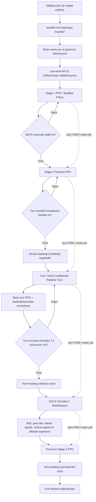

# AH-1S JSBSim Reinforcement Learning Uçuş Kontrol Projesi

Bu proje, **JSBSim içindeki `ah1s` helikopter modelini** kullanarak AH-1S için çok aşamalı bir uçuş görevinin **PPO tabanlı reinforcement learning (RL)**, **teacher–student / policy distillation**, **residual düzeltmeler** ve **AFCS destekli geçiş kontrolü** ile gerçekleştirilmesini amaçlar.

Repodaki iki görev zinciri:

> **Heading görevi:** Stage 1: Kalkış ve 300 ft hover → Stage 2: İleri uçuş → Turn: Relative turn → Recovery: Dönüş sonrası stabilizasyon → Post-turn Stage 2: Yeni heading üzerinde ileri uçuş
>
> **Durma görevi:** Stage 1: Kalkış ve 300 ft hover → Stage 2: İleri uçuş → Stage 3: 300 ft ilerideki hedef noktada durma + stabil hover

**İsimlendirme notu:** Dosya adlarındaki `stage3` (`models_stage3_hybrid_final/`, `validate_stage3_stop_hover.py`) *durma + hover* görevidir. Eski dokümanlarda ve canlı dashboard'un legend'ında dönüş fazı da "Stage 3 — Turn" diye geçer; bu README'de karışmaması için dönüş fazına **Turn** deniyor.

En önemli tasarım kararı, fazlar arasında simülasyonun yeniden başlatılmamasıdır. **Aynı JSBSim FDM (Flight Dynamics Model) ve aynı helikopter state’i bir sonraki faza aktarılır.** Böylece her policy yalnızca ideal bir başlangıç durumunda değil, önceki fazın gerçek dinamik çıktısı üzerinden çalışır.

> Bu repository bir **simülasyon / araştırma projesidir**. Buradaki action mapping, trim değerleri ve kontrol mantıkları JSBSim modeline yöneliktir; gerçek AH-1S uçuş kontrol sistemi için operasyonel talimat değildir.

---

# 1. Hızlı başlangıç

## 1.1. Colab (önerilen)

`stajım.ipynb` defterini Colab'da aç ve hücreleri sırayla çalıştır (`REPO_URL` bu fork'u gösteriyor; başka bir fork kullanıyorsan değiştir):

1. **Kurulum** — repo klonlanır/güncellenir, `requirements.txt` kurulur
2. **Hızlı kontrol** — model checksum'ları, derleme, kontrol yığınının yüklenmesi
3. **Canlı dashboard** — `%run run_colab_live_heading_dashboard.py`
4. **Doğrulama testleri** (heading görevi, Stage 3 durma + hover, turn robustness) ve 5. **GIF görselleştirme** (isteğe bağlı)

## 1.2. Terminal

```bash
git clone https://github.com/Ertovaski7/ah1s-rl-project.git
cd ah1s-rl-project
pip install -r requirements.txt

sha256sum -c models_sha256.txt                              # modeller sağlam mı?
python validate_final_continuous_mission_v1.py 20 -30 75    # heading görevi (headless)
python validate_stage3_stop_hover.py                        # Stage 1 → 2 → 3: hedefte durma + hover
python visualize_final_multiturn.py 20 -30 75               # aynı görev -> ah1s_final_multiturn.gif
```

**Tüm komutlar repo kökünden çalıştırılmalıdır** (model yolları köke göredir). `training/` altındaki scriptler bunu kendileri ayarlar.

## 1.3. Canlı target-heading dashboard

`run_colab_live_heading_dashboard.py`, Gradio/Hugging Face veya localhost kullanmadan doğrudan Colab hücresinin içinde çalışır. Stage 1'den itibaren aynı JSBSim FDM'i korur; kullanıcı çalışma devam ederken `0–359°` absolute target heading girer. 3D rota, top view, altitude profile ve telemetri gerçek simülasyon state'i ile canlı güncellenir.

```python
%cd /content/ah1s-rl-project
%run run_colab_live_heading_dashboard.py
```

Panelde `FORWARD / READY` görüldüğünde `Target Heading` alanına değer girilip `Fly to Heading` düğmesine basılır. Sistem komut başladığı andaki current heading ile hedef arasındaki en kısa relatif dönüşü hesaplar. Örneğin `350° -> 10°`, `+20°` komutuna çevrilir.

---

# 2. Repo yapısı

```text
ah1s-rl-project/
├── stajım.ipynb                             Colab defteri (kurulum → kontrol → dashboard → testler)
├── run_colab_live_heading_dashboard.py      Canlı target-heading dashboard (Colab içinde)
├── validate_final_continuous_mission_v1.py  Heading görevi: Stage1 → Stage2 → komutlar → recovery (headless)
├── validate_stage3_stop_hover.py            Durma görevi: Stage1 → Stage2 → Stage3 hedefte durma + 5 s hover
├── visualize_final_multiturn.py             Aynı görevi uçurup GIF olarak kaydeder
│
│   Environment'lar (Gymnasium + JSBSim)
├── helicopter_env_v2.py                     Temel AH-1S env (ilk Stage 1): FDM kurulumu, rotor warm-up, AFCS, trim
├── helicopter_env_stage1_distill.py         Stage 1: kalkış + 300 ft hover (18 feature, 4 action)
├── helicopter_env_stage2.py                 Stage 2 temel env: hover → ileri uçuş
├── helicopter_env_stage2_refine.py          Stage 2 refine: reset'te hazır hover, PPO sadece ileri uçuşu öğrenir
├── helicopter_env_stage2_refine_mapped.py   Stage 2: lateral/yaw action'larının fiziksel mapping'i
├── helicopter_env_turn_goal.py              Turn: goal-conditioned relative turn (16 feature)
├── helicopter_env_turn_goal_v2.py           Turn env, PPO fine-tune için güçlendirilmiş reward
├── helicopter_env_turn_goal_full_entry.py   Turn'ü gerçek Stage1→Stage2 giriş koşullarından başlatır
│
│   Final runtime modülleri (dosya adları tarihsel; "test_" olanlar da runtime'da kullanılır)
├── locked_stage1_stage2.py                  Kilitli Stage 1/2 modelleri + handoff yardımcıları (iki görev de kullanır)
├── validate_live_multiturn_same_fdm_v1.py   Stage1→Stage2 başlatma, aynı FDM'de ileri uçuş yardımcıları
├── test_turn_full_entry_v16_randomized_entry_robustness.py   Residual adapter sınıfı, randomized entry env
├── test_turn_full_entry_v22_v21_runtime.py  Turn stack action'ı (V5+V4+V7+V17+V21) + 20/20 testi
├── test_turn_arbitrary_angles_v1.py         load_stack(): tüm turn modellerini yükler
├── test_turn_arbitrary_angles_v3_heading_capture.py        Yeni heading'e AFCS capture
├── test_turn_arbitrary_angles_v5_direct_capture.py         Capture sırasında doğrudan fiziksel komut
├── test_turn_arbitrary_angles_v7_supervisory_primitives.py Keyfi açıyı doğrulanmış parçalara böler (planner)
├── test_turn_arbitrary_angles_v11_bumpless_supervisor.py   Parçalar arası bumpless recovery
│
├── training/                                Mevcut modelleri yeniden üreten scriptler (bkz. bölüm 5)
├── models_stage1_early_distilled/           Stage 1 modeli
├── models_stage2_hybrid_final/              Stage 2 modeli
├── models_stage3_hybrid_final/              Stage 3 (durma + hover) modeli
├── models_turn_hybrid/                      Turn stack modelleri + eğitim zincirinin ara checkpoint'leri
├── models_sha256.txt                        Model dosyalarının SHA-256 listesi
├── results_stage2_hybrid_final/             Stage 2 modelinin doğrulama kanıtı (summary + trace)
├── results_stage3_hybrid_final/             Stage 3 modelinin doğrulama kanıtı
├── results_stage3_lateral_*/                Stage 3 eğitim zincirinin girdileri (tanılama + teacher kalibrasyonu)
└── requirements.txt
```

Import zinciri — heading görevi (dashboard'dan aşağı doğru):

```text
run_colab_live_heading_dashboard.py / visualize_final_multiturn.py
└── validate_final_continuous_mission_v1.py        execute_command_same_fdm()
    ├── validate_live_multiturn_same_fdm_v1.py     build_initial_live_mission(), fly_stage2_between_turns()
    │   └── locked_stage1_stage2.py                Stage 1/2 modelleri → helicopter_env_stage1_distill, ..._stage2_refine_mapped
    ├── test_turn_arbitrary_angles_v7_...py        plan_command(), run_rl_primitive(), fine_afcs_tail()
    │   └── ..._v5_direct_capture.py → ..._v3_heading_capture.py
    ├── test_turn_arbitrary_angles_v11_...py       recover_bumpless()
    └── test_turn_arbitrary_angles_v1.py           load_stack()
        └── test_turn_full_entry_v22_...py (act) → test_turn_full_entry_v16_...py (ResidualAdapter)
            └── helicopter_env_turn_goal_full_entry → helicopter_env_turn_goal_v2 → helicopter_env_turn_goal
```

Durma görevi:

```text
validate_stage3_stop_hover.py          build_stage3_hover_handoff(), Stage 3 modeli
└── locked_stage1_stage2.py            Stage 1/2 modelleri → helicopter_env_stage1_distill, ..._stage2_refine_mapped
```

Repository’deki `vN` numaraları çoğunlukla **repair / training / validator sürümü**dür; görev stage numarası değildir.

---

# 3. Modeller

| Dosya | Rol | Kullanıldığı yer |
|---|---|---|
| `models_stage1_early_distilled/AH1S_STAGE1_EARLY_DISTILLED.zip` | Stage 1 policy (kilitli) | runtime |
| `models_stage2_hybrid_final/AH1S_STAGE2_HYBRID_FINAL.zip` | Stage 2 policy (kilitli) | runtime |
| `models_stage3_hybrid_final/AH1S_STAGE3_HYBRID_FINAL.zip` | Stage 3 policy — hedefte durma + hover (kilitli) | runtime (`validate_stage3_stop_hover.py`) |
| `models_turn_hybrid/AH1S_TURN_HYBRID_V5_COLLECTIVE_ONLY.zip` | V5 — base turn PPO | runtime |
| `models_turn_hybrid/AH1S_TURN_FULL_ENTRY_V4_RESIDUAL_ADAPTER.pt` | V4 — live-entry residual adapter | runtime |
| `models_turn_hybrid/AH1S_TURN_FULL_ENTRY_V7_GATED_200_PATCH.pt` | V7 — +200° gated patch | runtime |
| `models_turn_hybrid/AH1S_TURN_FULL_ENTRY_V17_ROBUST_50_PATCH.pt` | V17 — +50° robust patch | runtime |
| `models_turn_hybrid/AH1S_TURN_FULL_ENTRY_V21_STRONG_TERMINAL_50_PATCH.pt` | V21 — +50° terminal düzeltme | runtime |
| `models_turn_hybrid/AH1S_TURN_FULL_ENTRY_V13_GATED_50_PATCH.pt` | V13 — V17 eğitiminin başlangıç noktası | training |
| `models_turn_hybrid/AH1S_TURN_BC_WARMSTART.zip`, `..._V2_LAST.zip`, `..._V3_REPAIRED.zip` | Turn eğitim zincirinin ara adımları | training |

Runtime turn modelleri, orijinal "V22 20/20" doğrulamasında kullanılan dosyalarla; Stage 3 modeli de önceki geliştiricinin kilitlediği SHA-256 değeriyle byte-byte aynıdır. Kontrol için: `sha256sum -c models_sha256.txt`.

**Önemli:** Bu checkpoint'ler silinir ya da bozulursa training scriptlerini yeniden çalıştırmak aynı ağırlıkları birebir geri getirmez. Önce git geçmişinden geri yükleyin.

---

# 4. Doğrulama

```bash
# Heading görevi: Stage 1 → Stage 2 → sırayla relative turn komutları → recovery → ileri uçuş
# (hepsi aynı FDM'de). Beklenen son satır: FINAL CONTINUOUS MISSION: PASS
python validate_final_continuous_mission_v1.py 20 -30 75 -90 --forward-seconds 3

# Durma görevi: Stage 1 → Stage 2 → Stage 3, hedef noktada durma + 5 s hover (aynı FDM).
# Beklenen son satır: STAGE 3 STOP + HOVER: PASS
python validate_stage3_stop_hover.py

# Turn stack robustness: -50°, +50°, +200°, +360° × 5 randomized entry = 20 koşu.
# Beklenen: RANDOMIZED-ENTRY TOTAL: PASS=20/20 | SAFETY_FAILURES=0/20
python test_turn_full_entry_v22_v21_runtime.py
```

Komut açıları `1 <= |açı| <= 360` aralığında olmalıdır; `+` sağa (saat yönü), `−` sola döner.

---

# 5. Yeniden eğitim (`training/`)

Final sistemi çalıştırmak için eğitim **gerekmez**. `training/` klasörü, repodaki modellerin nasıl üretildiğini belgeler ve gerektiğinde yeniden üretmeye yarar. Scriptler repo kökünden ya da herhangi bir yerden çalıştırılabilir (`python training/<script>.py`); kendilerini repo köküne göre ayarlarlar. CPU'da uzun sürer.

**Stage 2** — `training/build_stage2_hybrid_final.py`: gerçek Stage 1 → Stage 2 handoff'unu yeniden üretir, script içine gömülü doğrulanmış referans uçuştan bir teacher kurar → behavior cloning warm-start → PPO fine-tune → teacher-OFF doğrulama. Çıktıyı `models_stage2_hybrid_final/AH1S_STAGE2_HYBRID_FINAL.zip` üzerine yazar; çalıştırmadan önce yedek alın.

**Stage 3 (durma + hover)** — üç adımlık zincir; her adımın girdisi repoda olduğu için yalnızca son adım da tek başına çalıştırılabilir:

```text
training/diagnose_stage3_lateral_v2.py          düşük hızda aileron authority tanılaması → results_stage3_lateral_diagnostic_v2/
→ training/calibrate_stage3_lateral_teacher_v3.py   lateral teacher kazanç kalibrasyonu → results_stage3_lateral_teacher_v3/final_summary.json
→ training/build_stage3_hybrid_final_v3.py          locked teacher → behavior cloning → PPO fine-tune → teacher-OFF doğrulama
```

Son adım `models_stage3_hybrid_final/AH1S_STAGE3_HYBRID_FINAL.zip`'in ve `results_stage3_hybrid_final/` kanıtlarının üzerine yazar; çalıştırmadan önce yedek alın.

**Turn stack** — `training/restore_current_turn_stack_v1.py` aşağıdaki zinciri sırayla çalıştırır, yalnızca eksik checkpoint'leri üretir ve sonunda V22 testini koşar:

```text
build_turn_hybrid_v1.py                       teacher dataset + BC warm-start
→ fine_tune_turn_rl_v2.py                     PPO fine-tune (V2)
→ repair_turn_hybrid_v3.py                    V3 repair
→ repair_turn_hybrid_v5_collective_only.py    V5 base turn PPO
→ train_turn_live_entry_v12_residual_all_targets.py   V4 live-entry residual adapter
→ train_turn_full_entry_v7_gated_200_patch.py         V7 (+200°)
→ make_v13_from_v7.py → train_turn_full_entry_v13_gated_50_patch.py (üretilir)   V13 (+50°)
→ train_turn_full_entry_v17_robust_50_patch.py        V17 (+50° robust)
→ train_turn_full_entry_v21_strong_terminal_50_patch.py   V21 (+50° terminal)
```

Not: Teacher dataset (`results_turn_hybrid/turn_teacher_dataset_v1.npz`) repoda olmadığı için restore scripti ilk adımı her zaman yeniden çalıştırır (runtime modelleri etkilenmez, ancak `AH1S_TURN_BC_WARMSTART.zip` yeniden yazılır).

**Stage 1** eğitim kodu repoda olmayan bir teacher modele bağlı olduğu için bu klasöre alınmadı; geçmişi `pre-cleanup` tag'inde `deneme/train_stage1_distill.py` ve `deneme/distill_stage1_early_cyclic_final.py` dosyalarındadır.

Bu zincirlerin çoğu saf PPO değil, **hybrid RL + distillation** (behavior cloning, residual adapter, gated patch) adımlarıdır.

---

# 6. Yeni curriculum eklerken

- **Hangi env'den başlanır?** İleri uçuşta irtifa/hız değişimi gibi senaryolar için `HelicopterEnvStage2RefineMapped`, heading değişimi için `HelicopterEnvTurnGoal` en yakın başlangıç noktalarıdır. Observation/reward/success kriterleri bu sınıflar alt-sınıflanarak değiştirilebilir.
- **Gerçekçi başlangıç state'i:** Yeni fazı ideal bir reset'ten değil, önceki fazın bıraktığı state'ten başlatmak için `validate_live_multiturn_same_fdm_v1.build_initial_live_mission()` ile Stage 1 → Stage 2 sonrası canlı FDM'i alıp env'e bağlama desenini (`make_turn_env()`: `env.fdm = fdm`, `reset()` çağrılmaz) örnek alın.
- **Hover'dan başlayan görevler:** `validate_stage3_stop_hover.build_stage3_hover_handoff()` canlı FDM'i hedef noktada 5 s stabil hover'da geri döndürür (`env1`, `env2`, `fdm`, `lat0/lon0`, `mission_heading`). İniş veya irtifa değişimi gibi yeni bir curriculum bu state'ten başlatılabilir; iş bitince `close_handoff(start)` çağrılır.
- **Eğitim:** Stable-Baselines3 `PPO("MlpPolicy", env, ...)` CPU'da çalışır. Yeni modeli ayrı bir `models_<curriculum>/` klasörüne kaydedin ve `models_sha256.txt`'ye ekleyin.
- **Düzen:** Deneme/ara sürüm scriptlerini köke eklemek yerine ayrı bir branch'te veya `experiments/` altında tutun; köke yalnızca doğrulanmış final dosyaları alın. Sonuç klasörleri (`results_*/`) `.gitignore`'dadır.

---

# 7. Temizlik notu (2026-09-21)

Repo, final sistemin kullanmadığı dosyalardan temizlendi (410 → 64 dosya, ~97 MB → ~4 MB; notebook 20 MB → 6 KB). Silinen her şey git geçmişinde durur; temizlik öncesi commit'i `pre-cleanup` tag'i ile işaretleyin (ya da upstream `selincyr/ah1s-rl-project` reposuna bakın).

Silinenler:

- `deneme/` — tarihsel env / train / test / kalibrasyon / diagnostic scriptleri. İçindeki 3 çekirdek env dosyası köke, 3 eğitim scripti `training/`'e taşındı.
- Eski hedef-bazlı full-mission validator zinciri (`validate_full_mission_v7…v23`, `run_final_regression_v23…v25`, `run_targeted_regression_v26…v29`) ve bunlara bağlı HTML replay üreticileri. Yerini `validate_final_continuous_mission_v1.py` + canlı dashboard aldı.
- Ara arbitrary-turn / full-entry deneyleri (v2, v4, v6, v8, v9, v10, v14, v15, v18, v20), `diagnose_*`, eski Gradio dashboard.
- **Stage 4 — iniş** çalışması (yarım kalmıştı; Eylül başındaki son notta teacher-off iniş henüz doğrulanmamıştı): modeller, teacher/DAgger/distillation scriptleri, `results_stage4_*` verileri (~60 MB) ve Stage 3'ün kilitli sürümden önceki deneme scriptleri. İniş curriculum'u tekrar ele alınacaksa `pre-cleanup` tag'indeki `STAGE4_PROGRESS_2026_09_06.md` başlangıç noktasıdır.
- Kopya/ara checkpoint'ler (kökteki `AH1S_*.zip` kopyaları, Stage 2 BC/RL ara adımları, `*_BEST.pt`) ve kullanılmayan tanılama çıktıları.

Bir dosyayı geri almak için: `git checkout pre-cleanup -- <yol>`

---

# 8. Genel algoritma akışı

Aşağıdaki akış heading görevini gösterir. Durma görevinde Stage 2, 80 ft ileride Stage 3'e devreder; Stage 3 hedef noktada durup hover tutar (bkz. bölüm 14).



Runtime veri akışı:

```text
JSBSim state
    ↓
Observation vector
    ↓
Aktif fazın PPO / control policy'si
    ↓
Normalized action [-1, 1]
    ↓
Physical control mapping
    ↓
collective / longitudinal cyclic / lateral cyclic / pedal
    ↓
JSBSim physics step
    ↓
Yeni state + reward + safety kontrolleri
```

---

# 9. AH-1S ve simülasyon tarafı

Projede gerçek uçuş donanımı yerine **JSBSim flight dynamics engine** ve JSBSim’in `ah1s` modeli kullanılmaktadır.

Temel ayarlar:

```text
JSBSim model     : ah1s
Initial condition: reset00.xml
Physics timestep : 0.0075 s
Physics/action   : 10 step
RL control dt    : ~0.075 s
Control frequency: ~13.33 Hz
Target altitude  : ~300 ft AGL
```

Rotor başlangıçta warm-up sürecinden geçirilir ve governor aktif hale getirilir. Roll, pitch ve yaw için AH-1S modelinin AFCS kanalları low-level stabilizasyon amacıyla kullanılabilir. Stage 1’in temel yaklaşımında altitude kontrolü AFCS’ye bırakılmaz; irtifa davranışı PPO tarafından öğrenilir.

---

# 10. Action space ve helikopter kontrol eksenleri

Policy’nin temel action vektörü dört boyutludur:

```python
Action = [a0, a1, a2, a3]
```

Tüm PPO action’ları normalize edilir:

```text
-1.0 <= action[i] <= +1.0
```

| Action | JSBSim kontrolü | Helikopter karşılığı | Temel etkisi |
|---|---|---|---|
| `a0` | Collective | Collective | Rotor toplam pitch/thrust; climb/descent/altitude |
| `a1` | Elevator | Longitudinal cyclic | Pitch ve ileri–geri hareket |
| `a2` | Aileron | Lateral cyclic | Roll ve lateral hareket |
| `a3` | Rudder | Pedal / yaw | Yaw ve heading |

`elevator`, `aileron` ve `rudder` isimleri JSBSim FCS property adlarıdır; helikopter açısından longitudinal cyclic, lateral cyclic ve pedal/yaw davranışını temsil edecek şekilde kullanılır.

## Stage 1 mapping

İlk Stage 1 geliştirmesinde PPO yalnızca collective üzerinde aktifti:

```text
a0 = -1 → collective ≈ 0.590
a0 =  0 → collective ≈ 0.620
a0 = +1 → collective ≈ 0.650
```

```python
collective = 0.620 + 0.030 * a0
```

Daha sonraki distilled Stage 1 sürümünde student dört action üretir; cyclic ve pedal komutları hover trim değerleri etrafında sınırlı authority ile uygulanır ve smoothing yapılır.

## Stage 2 mapping

Stage 2’de collective ve longitudinal cyclic ileri uçuş için aktiftir. Lateral/yaw mapping fiziksel residual olarak uygulanır:

```text
a2 → mevcut aileron trim + 0.026 * a2
a3 → mevcut rudder  trim + 0.040 * a3
```

## Turn mapping

```python
collective = clip(0.540 + 0.080 * a0, 0.460, 0.620)
elevator   = clip(-0.145 + 0.035 * a1, -0.180, -0.110)
aileron    = clip(0.19095 + 0.300 * a2, -1.0, 1.0)
rudder     = clip(0.39000 + 0.500 * a3, -1.0, 1.0)
```

Turn fazında lateral/yaw authority Stage 2’ye göre daha geniştir; çünkü policy gerçek bir yön değiştirme manevrası üretir.

---

# 11. Observation space

Temel observation yalnızca altitude değildir; translational ve rotational state birlikte kullanılır.

Temel 12 özellik:

| İndeks | Gözlem |
|---|---|
| 0 | Altitude error |
| 1 | Altitude |
| 2 | Vertical speed |
| 3 | Forward velocity |
| 4 | Lateral velocity |
| 5 | Pitch |
| 6 | Roll |
| 7 | Roll rate `p` |
| 8 | Pitch rate `q` |
| 9 | Yaw rate `r` |
| 10 | Heading error |
| 11 | Rotor RPM error |

Stage 1 distillation environment’ında:

```text
12 base feature
+ north
+ east
+ north velocity
+ east velocity
+ heading error
+ yaw rate
= 18 feature
```

Relative-turn environment’ında:

```text
12 Stage-2 feature
+ target_turn / 360
+ remaining_turn / 360
+ cumulative_turn / 360
+ direction
= 16 feature
```

Bu nedenle turn policy hem helikopterin mevcut durumunu hem de **hangi açı kadar dönmesi gerektiğini** bilir.

---

# 12. Stage 1 — Takeoff ve 300 ft hover

```text
motor / rotor hazır
→ takeoff
→ 300 ft’e climb
→ vertical speed’i azalt
→ 300 ft civarında stabil hover
```

Teacher–student distillation sırasında teacher action’ları eğitim scaffold’u olarak kullanılmıştır. Final runtime’da teacher kapalıdır.

Stage 1 tamamlandığında helikopter resetlenmez; altitude, velocity, attitude, angular rate, heading ve rotor state aynı FDM üzerinde Stage 2’ye aktarılır.

---

# 13. Stage 2 — Forward flight

Stage 2’nin amacı yaklaşık 300 ft irtifayı korurken kontrollü ileri uçuş üretmektir.

Reward bileşenlerinin ana mantığı:

- forward progress için pozitif reward,
- altitude error cezası,
- vertical speed cezası,
- hedef forward speed’den sapma cezası,
- lateral drift cezası,
- pitch/roll cezası,
- action smoothness cezası.

Standalone training environment’ında hedef forward distance 300 ft’dir. Full-mission turn handoff’unda ise yaklaşık **160 ft forward flight** sonrası turn entry oluşturulur.

---

# 14. Stage 3 — Hedef noktada durma + hover

Stage 2'nin ileri uçuşu, Stage 1 hover noktasından **80 ft** ileride Stage 3 policy'sine devredilir. Stage 3, **300 ft** ilerideki hedef noktada frenleyip durur ve orada stabil hover tutar. Görev aynı FDM üzerinde, teacher OFF çalışır (`validate_stage3_stop_hover.py`).

Observation (14 feature):

```text
altitude error, vertical speed, hedefe konum hatası, forward speed,
cross-track, lateral speed, sin(heading error), cos(heading error),
pitch, roll, roll rate p, pitch rate q, yaw rate r, rotor RPM
```

Action: 4 boyutlu PPO action'ı, Stage 2'nin fiziksel mapping'i (`HelicopterEnvStage2RefineMapped._apply_action`) üzerinden uygulanır.

Başarı — aşağıdakiler **5 s boyunca aynı anda** sağlanmalı:

```text
|konum hatası| <= 5 ft        |forward speed| <= 0.6 ft/s
|cross-track| <= 5 ft         |lateral speed| <= 0.6 ft/s
295 ft <= altitude <= 305 ft  |vertical speed| <= 0.75 ft/s
|heading error| <= 1°
```

Safety: irtifa 288–312 ft, |pitch| <= 8°, |roll| <= 10°, |cross-track| <= 15 ft.

Yöntem: kalibre edilmiş klasik teacher → behavior cloning → reward-based PPO fine-tune → teacher-OFF sürekli doğrulama.

Kilitli modelin sonucu (`results_stage3_hybrid_final/final_summary.json`):

```text
final forward        : 301.84 ft  (hedefe hata -1.84 ft)
final forward speed  : 0.47 ft/s   lateral speed: -0.20 ft/s
final cross-track    : -0.01 ft    max |cross-track|: 4.14 ft
final altitude       : 299.34 ft   aralık: 298.65–304.86 ft
final vertical speed : +0.01 ft/s  heading error: 0.09°
max |pitch| / |roll| : 0.82° / 2.92°
endpoint hover 5 s   : PASS
```

---

# 15. Turn — Relative turn (eski dokümanlarda "Stage 3")

Relative turn, dönüşün başladığı andaki heading’i referans alıp verilen açı kadar dönmektir.

Örnek:

```text
Başlangıç heading = 180°
Relative command  = +50°
Yeni yön          ≈ 230°
```

Projedeki işaret konvansiyonu:

```text
+ açı → sağa / saat yönünde
- açı → sola / saat yönünün tersine
```

`+360°` gibi manevralarda başlangıç ve bitiş heading’i aynı görünebilir. Bu yüzden yalnızca final heading karşılaştırılmaz; her step’te heading farkı unwrap edilerek **cumulative turn** tutulur:

```python
remaining_turn = requested_turn - cumulative_turn
```

## Turn success kriterleri

```text
|remaining turn| <= 1.5°
|roll|          <= 4°
|yaw rate|      <= 6°/s
285 ft <= altitude <= 315 ft
|vertical speed| <= 1.5 ft/s
forward speed >= 8 ft/s
```

Bu koşullar yaklaşık **3 saniye boyunca** korunmalıdır.

Safety sınırlarından bazıları:

```text
altitude < 275 ft veya > 325 ft
|roll| > 18°
|pitch| > 15°
|yaw rate| > 30°/s
forward speed < 1 ft/s
JSBSim failure
```

---

# 16. Turn policy stack’i

Final turn yaklaşımı tek bir modelden ibaret değildir:

```text
Base turn PPO
    +
Live-entry residual adapter
    +
Hedefe özel gated patch
    +
Gerekirse terminal correction
    ↓
Final action
    ↓
clip [-1, +1]
    ↓
JSBSim
```

Güncel doğrulanmış turn zincirinde temel roller:

```text
V5  → base turn PPO
V4  → live-entry residual adapter
V7  → +200° gated correction
V17 → +50° robust correction
V21 → +50° terminal correction
```

Residual modeller ana policy’nin öğrendiği davranışı tamamen değiştirmek yerine belirli problemli state bölgelerinde küçük düzeltmeler üretir.

## Keyfi açılar: supervisory planner

Specialist patch'ler yalnızca eğitildikleri açılarda (+50°, +200°) devreye girer. Kullanıcının girdiği keyfi bir komut için final sistem şu katmanları kullanır:

```text
plan_command()        (test_turn_arbitrary_angles_v7_...)  komutu doğrulanmış parçalara böler
                                                           ör. +120° → +50° → +50° → +20°
run_rl_primitive()    her parça turn stack ile uçulur; specialist olmayan açılarda hedefe
                      yaklaşınca yeni heading'e AFCS capture yapılır (v3 / v5)
recover_bumpless()    (test_turn_arbitrary_angles_v11_...) iki parça arasında ve komut sonunda
                      helikopteri stabil ileri uçuş zarfına geri getirir
fine_afcs_tail()      kalan küçük heading hatasını (<= 10°) AFCS ile kapatır
```

Bu hybrid bir supervisory controller'dır: tek bir PPO policy'nin her açıya genellediği iddia edilmez; komut keyfidir, parçalama içeride yapılır.

---

# 17. Teacher–Student / Policy Distillation

Teacher final runtime controller değildir.

Training mantığı:

```text
State
 ├──→ Teacher → reference/target action
 └──→ Student PPO → predicted action

training scaffold / distillation
        ↓
student daha fazla authority alır
        ↓
teacher blend azaltılır
        ↓
teacher OFF
```

Final görev:

```text
Teacher = OFF
Student / learned policy = ON
```

Teacher ağırlıkları runtime’da student’a aktarılmaz. Teacher eğitim sırasında hedef davranış/action sağlayan bir scaffold’dur. Reward ise görev hedefleri ve fiziksel hata metriklerinden ayrıca hesaplanır.

---

# 18. Transition neden var?

Dönüşün geometrik olarak tamamlanması ile helikopterin stabilize olması aynı şey değildir.

Turn sonunda heading doğru olsa bile helikopterde hâlâ:

```text
lateral velocity
roll
yaw rate
vertical speed
altitude deviation
```

kalabilir.

Bu yüzden Stage 2 PPO’ya doğrudan geçmek yerine **AFCS destekli transition** uygulanır:

```text
Turn target yakalandı
        ↓
Yeni heading referansı sabitlendi
        ↓
Roll azalt
Yaw-rate azalt
Lateral speed azalt
Vertical speed azalt
Altitude’u ~300 ft’e toparla
        ↓
Forward-flight için uygun state
        ↓
Stage 2 PPO tekrar devrede
```

> **Turn capture açıyı tamamlar; transition helikopteri o yeni açı üzerinde tekrar düzgün uçabilir hale getirir.**

Güncel implementasyon: `test_turn_arbitrary_angles_v11_bumpless_supervisor.recover_bumpless()` — önce elevator/aileron/rudder recovery trim'lerine yumuşakça (bumpless) kaydırılır, ardından collective ile irtifa ve vertical speed toparlanır.

---

# 19. Post-turn Stage 2

Transition’dan sonra aynı Stage 2 forward-flight policy yeniden kullanılır, fakat artık referans heading dönüş sonrası yeni yöndür.

```text
Eski heading      = 180°
Relative turn     = +50°
Yeni heading      ≈ 230°
Post-turn Stage 2 = 230° doğrultusunda ileri uçuş
```

Bu faz, helikopterin yalnızca hedef açıyı yakalamadığını, o yeni yönde kararlı şekilde uçuşa devam edebildiğini doğrular.

---

# 20. Neden fazlar arasında reset yok?

Görev zinciri:

```text
Stage 1 final state
    ↓
Stage 2 initial state
    ↓
Turn initial state
    ↓
Transition initial state
    ↓
Post-turn initial state
```

şeklinde gerçek state handoff’unu korur.

```text
NO RESET BETWEEN MISSION PHASES
```

Böylece sonraki policy, yapay olarak ideal bir başlangıç state’inden değil, önceki fazın gerçekten bıraktığı fiziksel durumdan başlar.

---

# 21. PPO bu projede nasıl çalışıyor?

Training döngüsü basitleştirilmiş haliyle:

```text
1. Observation al
2. PPO policy action üretir
3. Action physical control değerine map edilir
4. JSBSim physics ilerletilir
5. Yeni state okunur
6. Reward hesaplanır
7. Transition rollout buffer’a kaydedilir
8. PPO policy/value network güncellenir
9. Yeni rollout başlar
```

Runtime:

```text
obs → model.predict(..., deterministic=True) → action → JSBSim
```

Runtime sırasında training update yapılmaz.

---

# 22. Reward tasarımının genel mantığı

## Stage 1

- 300 ft’e yaklaşma,
- vertical speed kontrolü,
- hover stabilitesi,
- düşük drift,
- güvenli attitude ve rotor state.

## Stage 2

- forward progress,
- altitude hold,
- uygun forward speed,
- düşük lateral drift,
- düşük vertical speed,
- uygun pitch/roll,
- smooth action.

## Relative turn

Ana bileşen gerçek remaining-turn error reduction’dır:

```python
progress = abs(previous_remaining) - abs(remaining)
reward += 2.0 * progress
```

Buna altitude, vertical speed, forward speed, roll, yaw-rate ve action smoothness cezaları eklenir.

---

# 23. Doğrulama yaklaşımı

Turn sistemi yalnızca tek ideal başlangıç state’inde denenmemiştir. Full-entry robustness testlerinde Stage 2 fiziksel olarak farklı sürelerde devam ettirilerek farklı turn-entry state’leri oluşturulmuştur.

Doğrulanmış V22 sonucu:

```text
Targets: -50°, +50°, +200°, +360°
Seeds per target: 5
Toplam test: 20
PASS: 20 / 20
Safety failure: 0 / 20
```

State teleport edilmemiş; Stage 2 fiziksel olarak ek step’ler ilerletilerek giriş koşulu değiştirilmiştir.

Keyfi açılı ve ardışık komutlar için final mimari (planner + capture + bumpless recovery), `validate_final_continuous_mission_v1.py` ile tek bir canlı FDM üzerinde uçtan uca doğrulanır. Hedef-bazlı eski full-mission validator'ları (V7–V29) temizlikte kaldırılmıştır; git geçmişinde duruyor.

---

# 24. Kısa teknik özet

```text
Simulator        : JSBSim
Aircraft model   : ah1s
RL algorithm     : PPO
Framework        : Stable-Baselines3 + Gymnasium
Action space     : Box(-1, 1, shape=(4,))
Core controls    : collective, longitudinal cyclic, lateral cyclic, pedal
Base observation : 12 features
Stage1 distilled : 18 features
Stage3 (durma)   : 14 features, hedefte durma + hover
Turn observation : 16 features, goal-conditioned
Target altitude  : ~300 ft AGL
Turn examples    : -50°, +50°, +200°, +360°
Runtime teacher  : OFF
Phase reset      : YOK — aynı FDM korunur
Post-turn logic  : AFCS transition → Stage 2 PPO
```

---

# 25. Tek cümlede proje

> **AH-1S helikopteri JSBSim üzerinde PPO tabanlı policy’lerle 300 ft’e kaldıran, ileri uçuran, mevcut heading’e göre parametrik relative turn yaptıran, dönüş sonrası dinamikleri AFCS transition ile sönümleyip yeni heading üzerinde tekrar ileri uçuşa devam ettiren kesintisiz çok-aşamalı bir RL uçuş kontrol sistemidir.**
