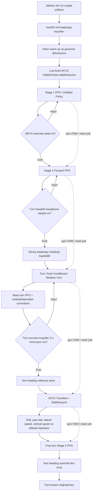
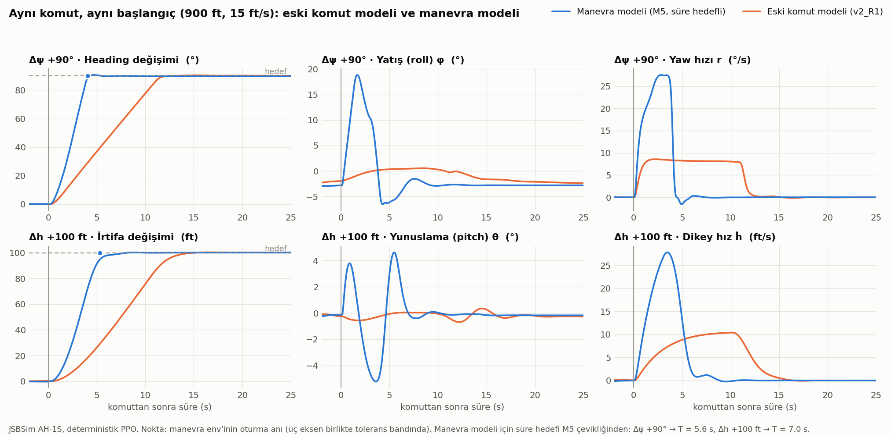
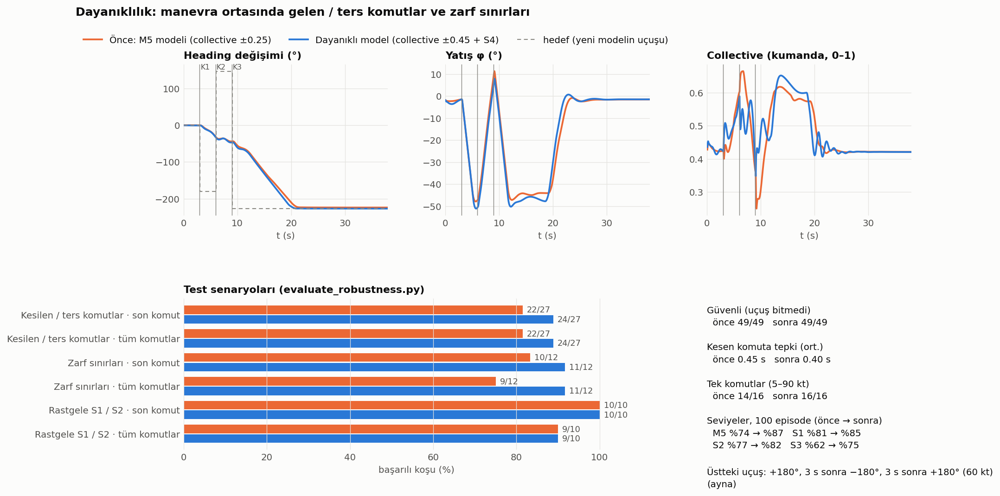
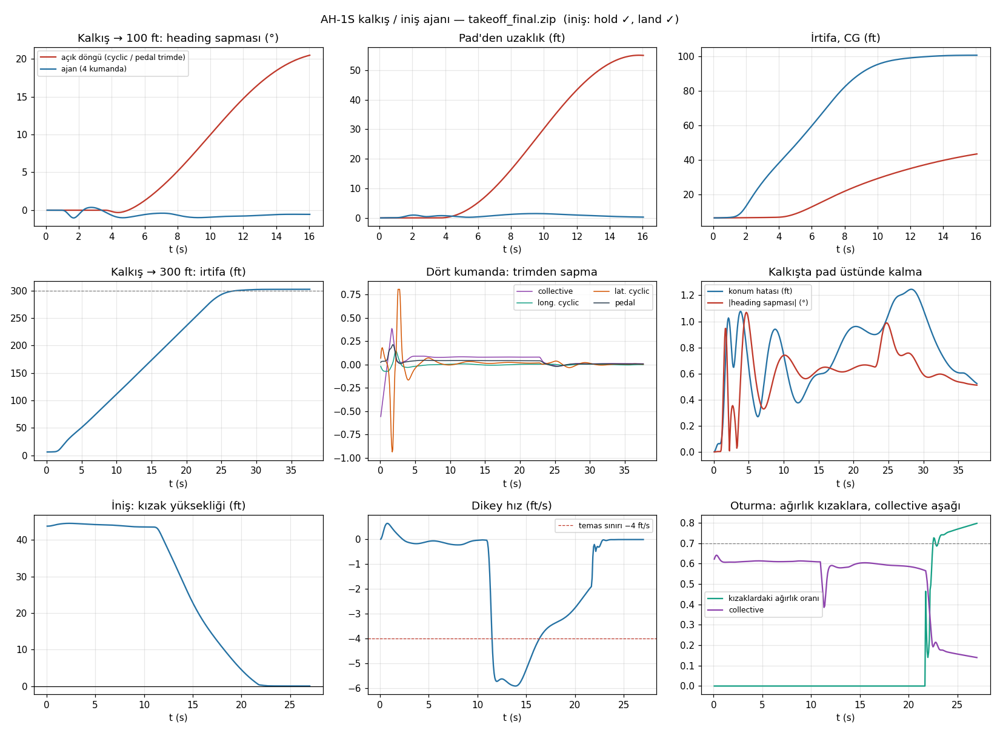

# AH-1S JSBSim Reinforcement Learning Uçuş Kontrol Projesi

Bu proje, **JSBSim içindeki `ah1s` helikopter modelini** kullanarak AH-1S için çok aşamalı bir uçuş görevinin **PPO tabanlı reinforcement learning (RL)**, **teacher–student / policy distillation**, **residual düzeltmeler** ve **AFCS destekli geçiş kontrolü** ile gerçekleştirilmesini amaçlar.

Repodaki iki görev zinciri:

> **Heading görevi:** Stage 1: Kalkış ve 300 ft hover → Stage 2: İleri uçuş → Turn: Relative turn → Recovery: Dönüş sonrası stabilizasyon → Post-turn Stage 2: Yeni heading üzerinde ileri uçuş
>
> **Durma görevi:** Stage 1: Kalkış ve 300 ft hover → Stage 2: İleri uçuş → Stage 3: 300 ft ilerideki hedef noktada durma + stabil hover

**İsimlendirme notu:** Dosya adlarındaki `stage3` (`models_stage3_hybrid_final/`, `validate_stage3_stop_hover.py`) *durma + hover* görevidir. Eski dokümanlarda ve canlı dashboard'un legend'ında dönüş fazı da "Stage 3 — Turn" diye geçer; bu README'de karışmaması için dönüş fazına **Turn** deniyor.

En önemli tasarım kararı, fazlar arasında simülasyonun yeniden başlatılmamasıdır. **Aynı JSBSim FDM (Flight Dynamics Model) ve aynı helikopter state’i bir sonraki faza aktarılır.** Böylece her policy yalnızca ideal bir başlangıç durumunda değil, önceki fazın gerçek dinamik çıktısı üzerinden çalışır.

> Bu repository bir **simülasyon / araştırma projesidir**. Buradaki action mapping, trim değerleri ve kontrol mantıkları JSBSim modeline yöneliktir; gerçek AH-1S uçuş kontrol sistemi için operasyonel talimat değildir.

---

# 1. Hızlı başlangıç

## 1.1. Colab (önerilen)

`stajım.ipynb` defterini Colab'da aç ve hücreleri sırayla çalıştır (`REPO_URL` bu fork'u gösteriyor; başka bir fork kullanıyorsan değiştir):

1. **Kurulum** — repo klonlanır/güncellenir, `requirements.txt` kurulur
2. **Hızlı kontrol** — model checksum'ları, derleme, kontrol yığınının yüklenmesi
3. **Canlı dashboard** — `%run run_colab_live_heading_dashboard.py`
4. **Doğrulama testleri** (heading görevi, Stage 3 durma + hover, turn robustness) ve 5. **GIF görselleştirme** (isteğe bağlı)

## 1.2. Terminal

```bash
git clone https://github.com/Ertovaski7/ah1s-rl-project.git
cd ah1s-rl-project
pip install -r requirements.txt

sha256sum -c models_sha256.txt                              # modeller sağlam mı?
python validate_final_continuous_mission_v1.py 20 -30 75    # heading görevi (headless)
python validate_stage3_stop_hover.py                        # Stage 1 → 2 → 3: hedefte durma + hover
python visualize_final_multiturn.py 20 -30 75               # aynı görev -> ah1s_final_multiturn.gif
```

**Tüm komutlar repo kökünden çalıştırılmalıdır** (model yolları köke göredir). `training/` altındaki scriptler bunu kendileri ayarlar.

## 1.3. Canlı target-heading dashboard

`run_colab_live_heading_dashboard.py`, Gradio/Hugging Face veya localhost kullanmadan doğrudan Colab hücresinin içinde çalışır. Stage 1'den itibaren aynı JSBSim FDM'i korur; kullanıcı çalışma devam ederken `0–359°` absolute target heading girer. 3D rota, top view, altitude profile ve telemetri gerçek simülasyon state'i ile canlı güncellenir.

```python
%cd /content/ah1s-rl-project
%run run_colab_live_heading_dashboard.py
```

Panelde `FORWARD / READY` görüldüğünde `Target Heading` alanına değer girilip `Fly to Heading` düğmesine basılır. Sistem komut başladığı andaki current heading ile hedef arasındaki en kısa relatif dönüşü hesaplar. Örneğin `350° -> 10°`, `+20°` komutuna çevrilir.

## 1.4. Yeni: Komut curriculum'u (PPO sıfırdan, teacher yok)

Arayüzden gelen **Δheading / Δhız / Δirtifa** komutlarını uygulayan tek bir PPO ajanı; küçük komutlardan
büyüğe otomatik curriculum (±5° → ±10° → … → hız → irtifa). Colab: `komut_curriculum.ipynb`.
Ayrıntılar ve ilk sonuçlar: **bölüm 26**.

```bash
python diagnose_command_env.py                                              # eğitimsiz sağlık kontrolü (~1 dk)
python train_command_curriculum.py --out runs/cmd --total-steps 6000000      # PPO sıfırdan, otomatik seviye atlama
python evaluate_command_policy.py --model runs/cmd/models/level_00_H1.zip --level H1 --zero-baseline
# eğitmeden, hazır modelle: tek uçuşta art arda komutlar
python evaluate_command_policy.py --model models_command_curriculum/v2_R1_final.zip --mission 5:heading:+90 40:speed:+8 75:altitude:+100
# canlı 3D görselleştirme: komut ver, helikopteri ve metrikleri izle (bölüm 27)
python command_viz.py                                                        # → http://127.0.0.1:8765
```

Colab'da canlı görselleştirme: `import command_viz; command_viz.colab()` (defterin 8. bölümü).

## 1.5. Yeni: Manevra curriculum'u (süre hedefli Δ komutları, 0–100 kt)

Aynı Δheading / Δhız / Δirtifa arayüzü, ama her komutun bir **süre hedefi** var ve ajan **attitude komutu** veriyor
(yatış ±60°, yunuslama ±30°): 90° dönüş 60 kt'ta ~48° yatışla ~6 s, hover'da ~30°/s pedal dönüşüyle ~4 s; +100 ft
~28 ft/s tırmanışla ~5 s. Eski komut ajanı aynı komutları 2–3° yatışla 11–23 s'de yapıyordu. Ayrıntılar: **bölüm 28**.

```bash
python train_command_curriculum.py --task maneuver --out runs/man --total-steps 8000000     # M1 → M5, PPO sıfırdan (~35 dk, 2 çekirdek)
python evaluate_maneuver_policy.py --model models_maneuver/maneuver_M5_final.zip --compare-old
python command_viz.py                    # canlı 3D: varsayılan artık manevra modeli (800 ft, 60 kt başlangıç)
```

## 1.6. Yeni: Dayanıklılık (robustness) — manevra ortasında gelen / ters komutlar, zarf sınırları

Rüzgâr eklenmeden önce: manevra bitmeden gelen komutlar (slalomda ani ters dönüş, dönüş ortasında ani tırmanış, ani
fren), hover / 100 kt / 250 ft sınırları. 49 koşuluk test takımı (`evaluate_robustness.py`) ve zorlayıcı eğitim seviyeleri
S1–S4. Testlerdeki hataların kök nedeni dar collective yetkisiydi (±0.25 → 55° yatışta irtifa tutulamıyor); yetki davranış
korunarak ±0.45'e genişletildi (`widen_collective.py`) ve S4'te ince ayar yapıldı: test senaryoları 40/49 → **44/49**,
tek komutlar 14/16 → **16/16**, M5 episode başarısı %74 → **%87**. Model: `models_maneuver/maneuver_robust_final.zip`
(görselleştirmenin yeni varsayılanı). Ayrıntılar: **bölüm 29**.

```bash
python evaluate_robustness.py --model models_maneuver/maneuver_robust_final.zip --compare models_maneuver/maneuver_M5_final.zip
python command_viz.py                    # canlı 3D: dayanıklı model; manevra sürerken yeni komut verilebilir
```

## 1.7. Yeni: Kalkış, hover ve iniş — dört kumanda doğrudan

Rotor warm-up'tan sonra yerden kalkış (12–1000 ft), hover, hover manevraları (yerinde dönüş, ileri / geri / yana kayma,
bob-up / down), kalkış sürerken hedef değişikliği, pad'e yumuşak iniş, ağırlık / CG (8500–10280 lbs) ve hover'da
bozucular. Ajan collective, longitudinal / lateral cyclic ve pedalın **dördünü de doğrudan** kullanıyor (AFCS yalnızca
SAS, hiçbir kumanda sınırlanmadı). PPO sıfırdan, seviyeler K1 → K9. Model `models_takeoff/takeoff_final.zip`: 28 test
senaryosunun 28'i başarılı, seviyelerde K1–K8 %100, K9 (karma) %95; inişte temas −2…−3.9 ft/s. İnişin öğrenilmesi
için bulunan engeller ve düzeltmeleri (keşif, yerel optimum, unutma, ödül tasarımı): **bölüm 30**.

```bash
python evaluate_takeoff.py --model models_takeoff/takeoff_final.zip        # 28 senaryo, ~3 dk
python command_viz.py --model models_takeoff/takeoff_final.zip             # canlı 3D: yerde başla, «Kalk / çık», iniş, bozucular
```

---

# 2. Repo yapısı

```text
ah1s-rl-project/
├── stajım.ipynb                             Colab defteri (kurulum → kontrol → dashboard → testler)
├── komut_curriculum.ipynb                   Colab defteri: komut curriculum'u (kurulum → eğitim → değerlendirme)
│
│   Komut curriculum'u — PPO sıfırdan, teacher yok (bölüm 26)
├── helicopter_env_command.py                Δheading / Δhız / Δirtifa komut takibi env'i (havada başlatma)
├── command_curriculum.py                    Seviyeler: H1 ±5° → … → H6 ±180° → V1–V3 hız → A1–A4 irtifa → C1, R1
├── train_command_curriculum.py              PPO eğitimi + otomatik seviye atlama (başarı ≥ %80)
├── evaluate_command_policy.py               Step response değerlendirmesi (+ a=0 karşılaştırması)
├── diagnose_command_env.py                  Eğitimsiz sağlık kontrolü (başlatma, açık-döngü tepkiler, hız)
├── command_viz.py                           Canlı 3D görselleştirme: sunucu + Colab + kayıt (bölüm 27; komut ve manevra)
├── viz/                                     Sayfa (command_viz.html), helikopter modeli (heli_bell.glb), demo uçuşları
├── models_command_curriculum/               Bu curriculum'un ilk koşularından modeller (v2_R1_final önerilen)
├── docs/command_curriculum/                 İlk koşuların kanıtları (ilerleme CSV, doğrulama, grafikler)
│
│   Manevra curriculum'u — süre hedefli Δ komutları, 0–100 kt (bölüm 28)
├── helicopter_env_maneuver.py               Komut env'inin alt sınıfı: attitude komutu (ACAH), hıza göre trim, süre hedefi
├── maneuver_curriculum.py                   Seviyeler M1 … M5 (çeviklik parametreleri → süre hedefi T)
├── evaluate_maneuver_policy.py              Tek komut testleri (0–90 kt) + eski komut modeliyle karşılaştırma
├── evaluate_robustness.py                   Dayanıklılık testleri: kesilen / ters komutlar, zarf sınırları (bölüm 29)
├── widen_collective.py                      Modelin collective yetkisini davranışı koruyarak genişletir (bölüm 29)
├── models_maneuver/                         maneuver_M5_final.zip (M1 → M5), maneuver_robust_final.zip (dayanıklı)
├── docs/maneuver_curriculum/                Koşunun kanıtları (ilerleme CSV, curriculum_state, doğrulama, grafik)
├── docs/robustness/                         Dayanıklılık kanıtları (test JSON / log'ları, eğitim CSV'leri, probe, grafik)
│
│   Kalkış, hover ve iniş — dört kumanda doğrudan (bölüm 30)
├── helicopter_env_takeoff.py                Yerden / havadan başlayan görev dizisi env'i: kalkış, hover, manevralar, iniş, bozucu
├── takeoff_curriculum.py                    Seviyeler K1 … K9 (+ K7a iniş okulu), tekrar (rehearsal), iniş profili ve süre hedefi
├── evaluate_takeoff.py                      28 sabit senaryo + seviye istatistikleri + dört kumandanın kullanımı
├── models_takeoff/                          takeoff_final.zip
├── docs/takeoff/                            Probe, şekil, senaryo / seviye sonuçları, koşuların CSV'leri
│
├── run_colab_live_heading_dashboard.py      Canlı target-heading dashboard (Colab içinde)
├── validate_final_continuous_mission_v1.py  Heading görevi: Stage1 → Stage2 → komutlar → recovery (headless)
├── validate_stage3_stop_hover.py            Durma görevi: Stage1 → Stage2 → Stage3 hedefte durma + 5 s hover
├── visualize_final_multiturn.py             Aynı görevi uçurup GIF olarak kaydeder
│
│   Environment'lar (Gymnasium + JSBSim)
├── helicopter_env_v2.py                     Temel AH-1S env (ilk Stage 1): FDM kurulumu, rotor warm-up, AFCS, trim
├── helicopter_env_stage1_distill.py         Stage 1: kalkış + 300 ft hover (18 feature, 4 action)
├── helicopter_env_stage2.py                 Stage 2 temel env: hover → ileri uçuş
├── helicopter_env_stage2_refine.py          Stage 2 refine: reset'te hazır hover, PPO sadece ileri uçuşu öğrenir
├── helicopter_env_stage2_refine_mapped.py   Stage 2: lateral/yaw action'larının fiziksel mapping'i
├── helicopter_env_turn_goal.py              Turn: goal-conditioned relative turn (16 feature)
├── helicopter_env_turn_goal_v2.py           Turn env, PPO fine-tune için güçlendirilmiş reward
├── helicopter_env_turn_goal_full_entry.py   Turn'ü gerçek Stage1→Stage2 giriş koşullarından başlatır
│
│   Final runtime modülleri (dosya adları tarihsel; "test_" olanlar da runtime'da kullanılır)
├── locked_stage1_stage2.py                  Kilitli Stage 1/2 modelleri + handoff yardımcıları (iki görev de kullanır)
├── validate_live_multiturn_same_fdm_v1.py   Stage1→Stage2 başlatma, aynı FDM'de ileri uçuş yardımcıları
├── test_turn_full_entry_v16_randomized_entry_robustness.py   Residual adapter sınıfı, randomized entry env
├── test_turn_full_entry_v22_v21_runtime.py  Turn stack action'ı (V5+V4+V7+V17+V21) + 20/20 testi
├── test_turn_arbitrary_angles_v1.py         load_stack(): tüm turn modellerini yükler
├── test_turn_arbitrary_angles_v3_heading_capture.py        Yeni heading'e AFCS capture
├── test_turn_arbitrary_angles_v5_direct_capture.py         Capture sırasında doğrudan fiziksel komut
├── test_turn_arbitrary_angles_v7_supervisory_primitives.py Keyfi açıyı doğrulanmış parçalara böler (planner)
├── test_turn_arbitrary_angles_v11_bumpless_supervisor.py   Parçalar arası bumpless recovery
│
├── training/                                Mevcut modelleri yeniden üreten scriptler (bkz. bölüm 5)
├── models_stage1_early_distilled/           Stage 1 modeli
├── models_stage2_hybrid_final/              Stage 2 modeli
├── models_stage3_hybrid_final/              Stage 3 (durma + hover) modeli
├── models_turn_hybrid/                      Turn stack modelleri + eğitim zincirinin ara checkpoint'leri
├── models_sha256.txt                        Model dosyalarının SHA-256 listesi
├── results_stage2_hybrid_final/             Stage 2 modelinin doğrulama kanıtı (summary + trace)
├── results_stage3_hybrid_final/             Stage 3 modelinin doğrulama kanıtı
├── results_stage3_lateral_*/                Stage 3 eğitim zincirinin girdileri (tanılama + teacher kalibrasyonu)
└── requirements.txt
```

Import zinciri — heading görevi (dashboard'dan aşağı doğru):

```text
run_colab_live_heading_dashboard.py / visualize_final_multiturn.py
└── validate_final_continuous_mission_v1.py        execute_command_same_fdm()
    ├── validate_live_multiturn_same_fdm_v1.py     build_initial_live_mission(), fly_stage2_between_turns()
    │   └── locked_stage1_stage2.py                Stage 1/2 modelleri → helicopter_env_stage1_distill, ..._stage2_refine_mapped
    ├── test_turn_arbitrary_angles_v7_...py        plan_command(), run_rl_primitive(), fine_afcs_tail()
    │   └── ..._v5_direct_capture.py → ..._v3_heading_capture.py
    ├── test_turn_arbitrary_angles_v11_...py       recover_bumpless()
    └── test_turn_arbitrary_angles_v1.py           load_stack()
        └── test_turn_full_entry_v22_...py (act) → test_turn_full_entry_v16_...py (ResidualAdapter)
            └── helicopter_env_turn_goal_full_entry → helicopter_env_turn_goal_v2 → helicopter_env_turn_goal
```

Durma görevi:

```text
validate_stage3_stop_hover.py          build_stage3_hover_handoff(), Stage 3 modeli
└── locked_stage1_stage2.py            Stage 1/2 modelleri → helicopter_env_stage1_distill, ..._stage2_refine_mapped
```

Repository’deki `vN` numaraları çoğunlukla **repair / training / validator sürümü**dür; görev stage numarası değildir.

---

# 3. Modeller

| Dosya | Rol | Kullanıldığı yer |
|---|---|---|
| `models_stage1_early_distilled/AH1S_STAGE1_EARLY_DISTILLED.zip` | Stage 1 policy (kilitli) | runtime |
| `models_stage2_hybrid_final/AH1S_STAGE2_HYBRID_FINAL.zip` | Stage 2 policy (kilitli) | runtime |
| `models_stage3_hybrid_final/AH1S_STAGE3_HYBRID_FINAL.zip` | Stage 3 policy — hedefte durma + hover (kilitli) | runtime (`validate_stage3_stop_hover.py`) |
| `models_turn_hybrid/AH1S_TURN_HYBRID_V5_COLLECTIVE_ONLY.zip` | V5 — base turn PPO | runtime |
| `models_turn_hybrid/AH1S_TURN_FULL_ENTRY_V4_RESIDUAL_ADAPTER.pt` | V4 — live-entry residual adapter | runtime |
| `models_turn_hybrid/AH1S_TURN_FULL_ENTRY_V7_GATED_200_PATCH.pt` | V7 — +200° gated patch | runtime |
| `models_turn_hybrid/AH1S_TURN_FULL_ENTRY_V17_ROBUST_50_PATCH.pt` | V17 — +50° robust patch | runtime |
| `models_turn_hybrid/AH1S_TURN_FULL_ENTRY_V21_STRONG_TERMINAL_50_PATCH.pt` | V21 — +50° terminal düzeltme | runtime |
| `models_turn_hybrid/AH1S_TURN_FULL_ENTRY_V13_GATED_50_PATCH.pt` | V13 — V17 eğitiminin başlangıç noktası | training |
| `models_turn_hybrid/AH1S_TURN_BC_WARMSTART.zip`, `..._V2_LAST.zip`, `..._V3_REPAIRED.zip` | Turn eğitim zincirinin ara adımları | training |
| `models_command_curriculum/v2_R1_final.zip` (+ ara seviyeler, v1) | Komut ajanı: Δheading / Δhız / Δirtifa, ~15 ft/s (bölüm 26) | `evaluate_command_policy.py`, `command_viz.py --model …` |
| `models_maneuver/maneuver_M5_final.zip` | Manevra ajanı: süre hedefli Δ komutları, 0–100 kt, attitude komutu (bölüm 28) | `evaluate_maneuver_policy.py`, `command_viz.py --model …` |
| `models_maneuver/maneuver_robust_final.zip` | Dayanıklı manevra ajanı: collective ±0.45 (modelin içinde kayıtlı) + S4 ince ayarı (bölüm 29) | `evaluate_robustness.py`, `command_viz.py` (varsayılan) |
| `models_takeoff/takeoff_final.zip` | Kalkış / hover / iniş ajanı: dört kumanda doğrudan, K1 → K9 (bölüm 30) | `evaluate_takeoff.py`, `command_viz.py --model …` |

Runtime turn modelleri, orijinal "V22 20/20" doğrulamasında kullanılan dosyalarla; Stage 3 modeli de önceki geliştiricinin kilitlediği SHA-256 değeriyle byte-byte aynıdır. Kontrol için: `sha256sum -c models_sha256.txt`.

**Önemli:** Bu checkpoint'ler silinir ya da bozulursa training scriptlerini yeniden çalıştırmak aynı ağırlıkları birebir geri getirmez. Önce git geçmişinden geri yükleyin.

---

# 4. Doğrulama

```bash
# Heading görevi: Stage 1 → Stage 2 → sırayla relative turn komutları → recovery → ileri uçuş
# (hepsi aynı FDM'de). Beklenen son satır: FINAL CONTINUOUS MISSION: PASS
python validate_final_continuous_mission_v1.py 20 -30 75 -90 --forward-seconds 3

# Durma görevi: Stage 1 → Stage 2 → Stage 3, hedef noktada durma + 5 s hover (aynı FDM).
# Beklenen son satır: STAGE 3 STOP + HOVER: PASS
python validate_stage3_stop_hover.py

# Turn stack robustness: -50°, +50°, +200°, +360° × 5 randomized entry = 20 koşu.
# Beklenen: RANDOMIZED-ENTRY TOTAL: PASS=20/20 | SAFETY_FAILURES=0/20
python test_turn_full_entry_v22_v21_runtime.py
```

Komut açıları `1 <= |açı| <= 360` aralığında olmalıdır; `+` sağa (saat yönü), `−` sola döner.

---

# 5. Yeniden eğitim (`training/`)

Final sistemi çalıştırmak için eğitim **gerekmez**. `training/` klasörü, repodaki modellerin nasıl üretildiğini belgeler ve gerektiğinde yeniden üretmeye yarar. Scriptler repo kökünden ya da herhangi bir yerden çalıştırılabilir (`python training/<script>.py`); kendilerini repo köküne göre ayarlarlar. CPU'da uzun sürer.

**Stage 2** — `training/build_stage2_hybrid_final.py`: gerçek Stage 1 → Stage 2 handoff'unu yeniden üretir, script içine gömülü doğrulanmış referans uçuştan bir teacher kurar → behavior cloning warm-start → PPO fine-tune → teacher-OFF doğrulama. Çıktıyı `models_stage2_hybrid_final/AH1S_STAGE2_HYBRID_FINAL.zip` üzerine yazar; çalıştırmadan önce yedek alın.

**Stage 3 (durma + hover)** — üç adımlık zincir; her adımın girdisi repoda olduğu için yalnızca son adım da tek başına çalıştırılabilir:

```text
training/diagnose_stage3_lateral_v2.py          düşük hızda aileron authority tanılaması → results_stage3_lateral_diagnostic_v2/
→ training/calibrate_stage3_lateral_teacher_v3.py   lateral teacher kazanç kalibrasyonu → results_stage3_lateral_teacher_v3/final_summary.json
→ training/build_stage3_hybrid_final_v3.py          locked teacher → behavior cloning → PPO fine-tune → teacher-OFF doğrulama
```

Son adım `models_stage3_hybrid_final/AH1S_STAGE3_HYBRID_FINAL.zip`'in ve `results_stage3_hybrid_final/` kanıtlarının üzerine yazar; çalıştırmadan önce yedek alın.

**Turn stack** — `training/restore_current_turn_stack_v1.py` aşağıdaki zinciri sırayla çalıştırır, yalnızca eksik checkpoint'leri üretir ve sonunda V22 testini koşar:

```text
build_turn_hybrid_v1.py                       teacher dataset + BC warm-start
→ fine_tune_turn_rl_v2.py                     PPO fine-tune (V2)
→ repair_turn_hybrid_v3.py                    V3 repair
→ repair_turn_hybrid_v5_collective_only.py    V5 base turn PPO
→ train_turn_live_entry_v12_residual_all_targets.py   V4 live-entry residual adapter
→ train_turn_full_entry_v7_gated_200_patch.py         V7 (+200°)
→ make_v13_from_v7.py → train_turn_full_entry_v13_gated_50_patch.py (üretilir)   V13 (+50°)
→ train_turn_full_entry_v17_robust_50_patch.py        V17 (+50° robust)
→ train_turn_full_entry_v21_strong_terminal_50_patch.py   V21 (+50° terminal)
```

Not: Teacher dataset (`results_turn_hybrid/turn_teacher_dataset_v1.npz`) repoda olmadığı için restore scripti ilk adımı her zaman yeniden çalıştırır (runtime modelleri etkilenmez, ancak `AH1S_TURN_BC_WARMSTART.zip` yeniden yazılır).

**Stage 1** eğitim kodu repoda olmayan bir teacher modele bağlı olduğu için bu klasöre alınmadı; geçmişi `pre-cleanup` tag'inde `deneme/train_stage1_distill.py` ve `deneme/distill_stage1_early_cyclic_final.py` dosyalarındadır.

Bu zincirlerin çoğu saf PPO değil, **hybrid RL + distillation** (behavior cloning, residual adapter, gated patch) adımlarıdır.

---

# 6. Yeni curriculum eklerken

- **Hangi env'den başlanır?** İleri uçuşta irtifa/hız değişimi gibi senaryolar için `HelicopterEnvStage2RefineMapped`, heading değişimi için `HelicopterEnvTurnGoal` en yakın başlangıç noktalarıdır. Observation/reward/success kriterleri bu sınıflar alt-sınıflanarak değiştirilebilir.
- **Gerçekçi başlangıç state'i:** Yeni fazı ideal bir reset'ten değil, önceki fazın bıraktığı state'ten başlatmak için `validate_live_multiturn_same_fdm_v1.build_initial_live_mission()` ile Stage 1 → Stage 2 sonrası canlı FDM'i alıp env'e bağlama desenini (`make_turn_env()`: `env.fdm = fdm`, `reset()` çağrılmaz) örnek alın.
- **Hover'dan başlayan görevler:** `validate_stage3_stop_hover.build_stage3_hover_handoff()` canlı FDM'i hedef noktada 5 s stabil hover'da geri döndürür (`env1`, `env2`, `fdm`, `lat0/lon0`, `mission_heading`). İniş veya irtifa değişimi gibi yeni bir curriculum bu state'ten başlatılabilir; iş bitince `close_handoff(start)` çağrılır.
- **Eğitim:** Stable-Baselines3 `PPO("MlpPolicy", env, ...)` CPU'da çalışır. Yeni modeli ayrı bir `models_<curriculum>/` klasörüne kaydedin ve `models_sha256.txt`'ye ekleyin.
- **Düzen:** Deneme/ara sürüm scriptlerini köke eklemek yerine ayrı bir branch'te veya `experiments/` altında tutun; köke yalnızca doğrulanmış final dosyaları alın. Sonuç klasörleri (`results_*/`) `.gitignore`'dadır.

---

# 7. Temizlik notu (2026-09-21)

Repo, final sistemin kullanmadığı dosyalardan temizlendi (410 → 64 dosya, ~97 MB → ~4 MB; notebook 20 MB → 6 KB). Silinen her şey git geçmişinde durur; temizlik öncesi commit'i `pre-cleanup` tag'i ile işaretleyin (ya da upstream `selincyr/ah1s-rl-project` reposuna bakın).

Silinenler:

- `deneme/` — tarihsel env / train / test / kalibrasyon / diagnostic scriptleri. İçindeki 3 çekirdek env dosyası köke, 3 eğitim scripti `training/`'e taşındı.
- Eski hedef-bazlı full-mission validator zinciri (`validate_full_mission_v7…v23`, `run_final_regression_v23…v25`, `run_targeted_regression_v26…v29`) ve bunlara bağlı HTML replay üreticileri. Yerini `validate_final_continuous_mission_v1.py` + canlı dashboard aldı.
- Ara arbitrary-turn / full-entry deneyleri (v2, v4, v6, v8, v9, v10, v14, v15, v18, v20), `diagnose_*`, eski Gradio dashboard.
- **Stage 4 — iniş** çalışması (yarım kalmıştı; Eylül başındaki son notta teacher-off iniş henüz doğrulanmamıştı): modeller, teacher/DAgger/distillation scriptleri, `results_stage4_*` verileri (~60 MB) ve Stage 3'ün kilitli sürümden önceki deneme scriptleri. İniş curriculum'u tekrar ele alınacaksa `pre-cleanup` tag'indeki `STAGE4_PROGRESS_2026_09_06.md` başlangıç noktasıdır.
- Kopya/ara checkpoint'ler (kökteki `AH1S_*.zip` kopyaları, Stage 2 BC/RL ara adımları, `*_BEST.pt`) ve kullanılmayan tanılama çıktıları.

Bir dosyayı geri almak için: `git checkout pre-cleanup -- <yol>`

---

# 8. Genel algoritma akışı

Aşağıdaki akış heading görevini gösterir. Durma görevinde Stage 2, 80 ft ileride Stage 3'e devreder; Stage 3 hedef noktada durup hover tutar (bkz. bölüm 14).


```mermaid
flowchart TD
    A[JSBSim AH-1S modeli yüklenir] --> B[reset00.xml başlangıç koşulları]
    B --> C[Rotor warm-up ve governor aktivasyonu]
    C --> D[Low-level AFCS roll/pitch/yaw stabilizasyonu]

    D --> E[Stage 1 PPO / Distilled Policy]
    E --> F{300 ft civarında stabil mi?}
    F -- Hayır --> E
    F -- Evet --> G[Stage 2 Forward PPO]

    G --> H{Turn handoff mesafesine ulaşıldı mı?}
    H -- Hayır --> G
    H -- Evet --> I[Dönüş başlangıç heading'i kaydedilir]

    I --> J[Turn: Goal-Conditioned Relative Turn]
    J --> K[Base turn PPO + residual/specialist corrections]
    K --> L{Turn success koşulları 3 s korunuyor mu?}
    L -- Hayır --> J

    L -- Evet --> M[Yeni heading referansı alınır]
    M --> N[AFCS Transition / Stabilizasyon]
    N --> O[Roll, yaw-rate, lateral speed, vertical speed ve altitude toparlanır]

    O --> P[Post-turn Stage 2 PPO]
    P --> Q[Yeni heading üzerinde ileri uçuş]
    Q --> R[Full mission doğrulaması]

    E -. aynı FDM / reset yok .-> G
    G -. aynı FDM / reset yok .-> J
    J -. aynı FDM / reset yok .-> N
    N -. aynı FDM / reset yok .-> P
```

Runtime veri akışı:

```text
JSBSim state
    ↓
Observation vector
    ↓
Aktif fazın PPO / control policy'si
    ↓
Normalized action [-1, 1]
    ↓
Physical control mapping
    ↓
collective / longitudinal cyclic / lateral cyclic / pedal
    ↓
JSBSim physics step
    ↓
Yeni state + reward + safety kontrolleri
```

---

# 9. AH-1S ve simülasyon tarafı

Projede gerçek uçuş donanımı yerine **JSBSim flight dynamics engine** ve JSBSim’in `ah1s` modeli kullanılmaktadır.

Temel ayarlar:

```text
JSBSim model     : ah1s
Initial condition: reset00.xml
Physics timestep : 0.0075 s
Physics/action   : 10 step
RL control dt    : ~0.075 s
Control frequency: ~13.33 Hz
Target altitude  : ~300 ft AGL
```

Rotor başlangıçta warm-up sürecinden geçirilir ve governor aktif hale getirilir. Roll, pitch ve yaw için AH-1S modelinin AFCS kanalları low-level stabilizasyon amacıyla kullanılabilir. Stage 1’in temel yaklaşımında altitude kontrolü AFCS’ye bırakılmaz; irtifa davranışı PPO tarafından öğrenilir.

---

# 10. Action space ve helikopter kontrol eksenleri

Policy’nin temel action vektörü dört boyutludur:

```python
Action = [a0, a1, a2, a3]
```

Tüm PPO action’ları normalize edilir:

```text
-1.0 <= action[i] <= +1.0
```

| Action | JSBSim kontrolü | Helikopter karşılığı | Temel etkisi |
|---|---|---|---|
| `a0` | Collective | Collective | Rotor toplam pitch/thrust; climb/descent/altitude |
| `a1` | Elevator | Longitudinal cyclic | Pitch ve ileri–geri hareket |
| `a2` | Aileron | Lateral cyclic | Roll ve lateral hareket |
| `a3` | Rudder | Pedal / yaw | Yaw ve heading |

`elevator`, `aileron` ve `rudder` isimleri JSBSim FCS property adlarıdır; helikopter açısından longitudinal cyclic, lateral cyclic ve pedal/yaw davranışını temsil edecek şekilde kullanılır.

## Stage 1 mapping

İlk Stage 1 geliştirmesinde PPO yalnızca collective üzerinde aktifti:

```text
a0 = -1 → collective ≈ 0.590
a0 =  0 → collective ≈ 0.620
a0 = +1 → collective ≈ 0.650
```

```python
collective = 0.620 + 0.030 * a0
```

Daha sonraki distilled Stage 1 sürümünde student dört action üretir; cyclic ve pedal komutları hover trim değerleri etrafında sınırlı authority ile uygulanır ve smoothing yapılır.

## Stage 2 mapping

Stage 2’de collective ve longitudinal cyclic ileri uçuş için aktiftir. Lateral/yaw mapping fiziksel residual olarak uygulanır:

```text
a2 → mevcut aileron trim + 0.026 * a2
a3 → mevcut rudder  trim + 0.040 * a3
```

## Turn mapping

```python
collective = clip(0.540 + 0.080 * a0, 0.460, 0.620)
elevator   = clip(-0.145 + 0.035 * a1, -0.180, -0.110)
aileron    = clip(0.19095 + 0.300 * a2, -1.0, 1.0)
rudder     = clip(0.39000 + 0.500 * a3, -1.0, 1.0)
```

Turn fazında lateral/yaw authority Stage 2’ye göre daha geniştir; çünkü policy gerçek bir yön değiştirme manevrası üretir.

---

# 11. Observation space

Temel observation yalnızca altitude değildir; translational ve rotational state birlikte kullanılır.

Temel 12 özellik:

| İndeks | Gözlem |
|---|---|
| 0 | Altitude error |
| 1 | Altitude |
| 2 | Vertical speed |
| 3 | Forward velocity |
| 4 | Lateral velocity |
| 5 | Pitch |
| 6 | Roll |
| 7 | Roll rate `p` |
| 8 | Pitch rate `q` |
| 9 | Yaw rate `r` |
| 10 | Heading error |
| 11 | Rotor RPM error |

Stage 1 distillation environment’ında:

```text
12 base feature
+ north
+ east
+ north velocity
+ east velocity
+ heading error
+ yaw rate
= 18 feature
```

Relative-turn environment’ında:

```text
12 Stage-2 feature
+ target_turn / 360
+ remaining_turn / 360
+ cumulative_turn / 360
+ direction
= 16 feature
```

Bu nedenle turn policy hem helikopterin mevcut durumunu hem de **hangi açı kadar dönmesi gerektiğini** bilir.

---

# 12. Stage 1 — Takeoff ve 300 ft hover

```text
motor / rotor hazır
→ takeoff
→ 300 ft’e climb
→ vertical speed’i azalt
→ 300 ft civarında stabil hover
```

Teacher–student distillation sırasında teacher action’ları eğitim scaffold’u olarak kullanılmıştır. Final runtime’da teacher kapalıdır.

Stage 1 tamamlandığında helikopter resetlenmez; altitude, velocity, attitude, angular rate, heading ve rotor state aynı FDM üzerinde Stage 2’ye aktarılır.

---

# 13. Stage 2 — Forward flight

Stage 2’nin amacı yaklaşık 300 ft irtifayı korurken kontrollü ileri uçuş üretmektir.

Reward bileşenlerinin ana mantığı:

- forward progress için pozitif reward,
- altitude error cezası,
- vertical speed cezası,
- hedef forward speed’den sapma cezası,
- lateral drift cezası,
- pitch/roll cezası,
- action smoothness cezası.

Standalone training environment’ında hedef forward distance 300 ft’dir. Full-mission turn handoff’unda ise yaklaşık **160 ft forward flight** sonrası turn entry oluşturulur.

---

# 14. Stage 3 — Hedef noktada durma + hover

Stage 2'nin ileri uçuşu, Stage 1 hover noktasından **80 ft** ileride Stage 3 policy'sine devredilir. Stage 3, **300 ft** ilerideki hedef noktada frenleyip durur ve orada stabil hover tutar. Görev aynı FDM üzerinde, teacher OFF çalışır (`validate_stage3_stop_hover.py`).

Observation (14 feature):

```text
altitude error, vertical speed, hedefe konum hatası, forward speed,
cross-track, lateral speed, sin(heading error), cos(heading error),
pitch, roll, roll rate p, pitch rate q, yaw rate r, rotor RPM
```

Action: 4 boyutlu PPO action'ı, Stage 2'nin fiziksel mapping'i (`HelicopterEnvStage2RefineMapped._apply_action`) üzerinden uygulanır.

Başarı — aşağıdakiler **5 s boyunca aynı anda** sağlanmalı:

```text
|konum hatası| <= 5 ft        |forward speed| <= 0.6 ft/s
|cross-track| <= 5 ft         |lateral speed| <= 0.6 ft/s
295 ft <= altitude <= 305 ft  |vertical speed| <= 0.75 ft/s
|heading error| <= 1°
```

Safety: irtifa 288–312 ft, |pitch| <= 8°, |roll| <= 10°, |cross-track| <= 15 ft.

Yöntem: kalibre edilmiş klasik teacher → behavior cloning → reward-based PPO fine-tune → teacher-OFF sürekli doğrulama.

Kilitli modelin sonucu (`results_stage3_hybrid_final/final_summary.json`):

```text
final forward        : 301.84 ft  (hedefe hata -1.84 ft)
final forward speed  : 0.47 ft/s   lateral speed: -0.20 ft/s
final cross-track    : -0.01 ft    max |cross-track|: 4.14 ft
final altitude       : 299.34 ft   aralık: 298.65–304.86 ft
final vertical speed : +0.01 ft/s  heading error: 0.09°
max |pitch| / |roll| : 0.82° / 2.92°
endpoint hover 5 s   : PASS
```

---

# 15. Turn — Relative turn (eski dokümanlarda "Stage 3")

Relative turn, dönüşün başladığı andaki heading’i referans alıp verilen açı kadar dönmektir.

Örnek:

```text
Başlangıç heading = 180°
Relative command  = +50°
Yeni yön          ≈ 230°
```

Projedeki işaret konvansiyonu:

```text
+ açı → sağa / saat yönünde
- açı → sola / saat yönünün tersine
```

`+360°` gibi manevralarda başlangıç ve bitiş heading’i aynı görünebilir. Bu yüzden yalnızca final heading karşılaştırılmaz; her step’te heading farkı unwrap edilerek **cumulative turn** tutulur:

```python
remaining_turn = requested_turn - cumulative_turn
```

## Turn success kriterleri

```text
|remaining turn| <= 1.5°
|roll|          <= 4°
|yaw rate|      <= 6°/s
285 ft <= altitude <= 315 ft
|vertical speed| <= 1.5 ft/s
forward speed >= 8 ft/s
```

Bu koşullar yaklaşık **3 saniye boyunca** korunmalıdır.

Safety sınırlarından bazıları:

```text
altitude < 275 ft veya > 325 ft
|roll| > 18°
|pitch| > 15°
|yaw rate| > 30°/s
forward speed < 1 ft/s
JSBSim failure
```

---

# 16. Turn policy stack’i

Final turn yaklaşımı tek bir modelden ibaret değildir:

```text
Base turn PPO
    +
Live-entry residual adapter
    +
Hedefe özel gated patch
    +
Gerekirse terminal correction
    ↓
Final action
    ↓
clip [-1, +1]
    ↓
JSBSim
```

Güncel doğrulanmış turn zincirinde temel roller:

```text
V5  → base turn PPO
V4  → live-entry residual adapter
V7  → +200° gated correction
V17 → +50° robust correction
V21 → +50° terminal correction
```

Residual modeller ana policy’nin öğrendiği davranışı tamamen değiştirmek yerine belirli problemli state bölgelerinde küçük düzeltmeler üretir.

## Keyfi açılar: supervisory planner

Specialist patch'ler yalnızca eğitildikleri açılarda (+50°, +200°) devreye girer. Kullanıcının girdiği keyfi bir komut için final sistem şu katmanları kullanır:

```text
plan_command()        (test_turn_arbitrary_angles_v7_...)  komutu doğrulanmış parçalara böler
                                                           ör. +120° → +50° → +50° → +20°
run_rl_primitive()    her parça turn stack ile uçulur; specialist olmayan açılarda hedefe
                      yaklaşınca yeni heading'e AFCS capture yapılır (v3 / v5)
recover_bumpless()    (test_turn_arbitrary_angles_v11_...) iki parça arasında ve komut sonunda
                      helikopteri stabil ileri uçuş zarfına geri getirir
fine_afcs_tail()      kalan küçük heading hatasını (<= 10°) AFCS ile kapatır
```

Bu hybrid bir supervisory controller'dır: tek bir PPO policy'nin her açıya genellediği iddia edilmez; komut keyfidir, parçalama içeride yapılır.

---

# 17. Teacher–Student / Policy Distillation

Teacher final runtime controller değildir.

Training mantığı:

```text
State
 ├──→ Teacher → reference/target action
 └──→ Student PPO → predicted action

training scaffold / distillation
        ↓
student daha fazla authority alır
        ↓
teacher blend azaltılır
        ↓
teacher OFF
```

Final görev:

```text
Teacher = OFF
Student / learned policy = ON
```

Teacher ağırlıkları runtime’da student’a aktarılmaz. Teacher eğitim sırasında hedef davranış/action sağlayan bir scaffold’dur. Reward ise görev hedefleri ve fiziksel hata metriklerinden ayrıca hesaplanır.

---

# 18. Transition neden var?

Dönüşün geometrik olarak tamamlanması ile helikopterin stabilize olması aynı şey değildir.

Turn sonunda heading doğru olsa bile helikopterde hâlâ:

```text
lateral velocity
roll
yaw rate
vertical speed
altitude deviation
```

kalabilir.

Bu yüzden Stage 2 PPO’ya doğrudan geçmek yerine **AFCS destekli transition** uygulanır:

```text
Turn target yakalandı
        ↓
Yeni heading referansı sabitlendi
        ↓
Roll azalt
Yaw-rate azalt
Lateral speed azalt
Vertical speed azalt
Altitude’u ~300 ft’e toparla
        ↓
Forward-flight için uygun state
        ↓
Stage 2 PPO tekrar devrede
```

> **Turn capture açıyı tamamlar; transition helikopteri o yeni açı üzerinde tekrar düzgün uçabilir hale getirir.**

Güncel implementasyon: `test_turn_arbitrary_angles_v11_bumpless_supervisor.recover_bumpless()` — önce elevator/aileron/rudder recovery trim'lerine yumuşakça (bumpless) kaydırılır, ardından collective ile irtifa ve vertical speed toparlanır.

---

# 19. Post-turn Stage 2

Transition’dan sonra aynı Stage 2 forward-flight policy yeniden kullanılır, fakat artık referans heading dönüş sonrası yeni yöndür.

```text
Eski heading      = 180°
Relative turn     = +50°
Yeni heading      ≈ 230°
Post-turn Stage 2 = 230° doğrultusunda ileri uçuş
```

Bu faz, helikopterin yalnızca hedef açıyı yakalamadığını, o yeni yönde kararlı şekilde uçuşa devam edebildiğini doğrular.

---

# 20. Neden fazlar arasında reset yok?

Görev zinciri:

```text
Stage 1 final state
    ↓
Stage 2 initial state
    ↓
Turn initial state
    ↓
Transition initial state
    ↓
Post-turn initial state
```

şeklinde gerçek state handoff’unu korur.

```text
NO RESET BETWEEN MISSION PHASES
```

Böylece sonraki policy, yapay olarak ideal bir başlangıç state’inden değil, önceki fazın gerçekten bıraktığı fiziksel durumdan başlar.

---

# 21. PPO bu projede nasıl çalışıyor?

Training döngüsü basitleştirilmiş haliyle:

```text
1. Observation al
2. PPO policy action üretir
3. Action physical control değerine map edilir
4. JSBSim physics ilerletilir
5. Yeni state okunur
6. Reward hesaplanır
7. Transition rollout buffer’a kaydedilir
8. PPO policy/value network güncellenir
9. Yeni rollout başlar
```

Runtime:

```text
obs → model.predict(..., deterministic=True) → action → JSBSim
```

Runtime sırasında training update yapılmaz.

---

# 22. Reward tasarımının genel mantığı

## Stage 1

- 300 ft’e yaklaşma,
- vertical speed kontrolü,
- hover stabilitesi,
- düşük drift,
- güvenli attitude ve rotor state.

## Stage 2

- forward progress,
- altitude hold,
- uygun forward speed,
- düşük lateral drift,
- düşük vertical speed,
- uygun pitch/roll,
- smooth action.

## Relative turn

Ana bileşen gerçek remaining-turn error reduction’dır:

```python
progress = abs(previous_remaining) - abs(remaining)
reward += 2.0 * progress
```

Buna altitude, vertical speed, forward speed, roll, yaw-rate ve action smoothness cezaları eklenir.

---

# 23. Doğrulama yaklaşımı

Turn sistemi yalnızca tek ideal başlangıç state’inde denenmemiştir. Full-entry robustness testlerinde Stage 2 fiziksel olarak farklı sürelerde devam ettirilerek farklı turn-entry state’leri oluşturulmuştur.

Doğrulanmış V22 sonucu:

```text
Targets: -50°, +50°, +200°, +360°
Seeds per target: 5
Toplam test: 20
PASS: 20 / 20
Safety failure: 0 / 20
```

State teleport edilmemiş; Stage 2 fiziksel olarak ek step’ler ilerletilerek giriş koşulu değiştirilmiştir.

Keyfi açılı ve ardışık komutlar için final mimari (planner + capture + bumpless recovery), `validate_final_continuous_mission_v1.py` ile tek bir canlı FDM üzerinde uçtan uca doğrulanır. Hedef-bazlı eski full-mission validator'ları (V7–V29) temizlikte kaldırılmıştır; git geçmişinde duruyor.

---

# 24. Kısa teknik özet

```text
Simulator        : JSBSim
Aircraft model   : ah1s
RL algorithm     : PPO
Framework        : Stable-Baselines3 + Gymnasium
Action space     : Box(-1, 1, shape=(4,))
Core controls    : collective, longitudinal cyclic, lateral cyclic, pedal
Base observation : 12 features
Stage1 distilled : 18 features
Stage3 (durma)   : 14 features, hedefte durma + hover
Turn observation : 16 features, goal-conditioned
Target altitude  : ~300 ft AGL
Turn examples    : -50°, +50°, +200°, +360°
Runtime teacher  : OFF
Phase reset      : YOK — aynı FDM korunur
Post-turn logic  : AFCS transition → Stage 2 PPO
```

---

# 25. Tek cümlede proje

> **AH-1S helikopteri JSBSim üzerinde PPO tabanlı policy’lerle 300 ft’e kaldıran, ileri uçuran, mevcut heading’e göre parametrik relative turn yaptıran, dönüş sonrası dinamikleri AFCS transition ile sönümleyip yeni heading üzerinde tekrar ileri uçuşa devam ettiren kesintisiz çok-aşamalı bir RL uçuş kontrol sistemidir.**

---

# 26. Komut curriculum'u — Δheading / Δhız / Δirtifa (PPO sıfırdan, 2026-09-22)

**Amaç:** hangi irtifa / heading / hızdan başlarsa başlasın, arayüzden gelen **Δheading, Δhız, Δirtifa** komutlarını uygulayan **tek** bir PPO ajanı.

**Mentor kararı (2026-09-22):** teacher / student distillation yok (1000 ft'e kadar deneme-yanılma ile student üretmek pahalı). PPO **rastgele ağırlıklarla** başlar; helikopter belirli bir irtifada (**300 ft, 15 ft/s**) başlar; kısa episode'larda önce **±5°** heading, öğrenince **±10°**, ... sonra hız için aynısı. Rüzgâr yok.

Colab: `komut_curriculum.ipynb` (kurulum → Drive → sağlık kontrolü → eğitim → ilerleme grafiği → değerlendirme → görev demosu).

## 26.1. Eski zincirden farkı

| | Eski zincir (Stage 1/2, Turn) | Komut curriculum'u |
|---|---|---|
| Hedef | 300 ft sabit; obs'ta mutlak irtifa var | yalnızca komuta göre **hata**; mutlak irtifa / heading yok |
| Eğitim | klasik teacher → behavior cloning → kısa PPO | **PPO sıfırdan**, teacher yok |
| Heading'i kim tutar | AFCS heading-hold (`psi-trim`) | **PPO** (AFCS heading-hold kapalı, yalnızca yaw damper) |
| Başlangıç | yerden kalkış (~70 s sim) | **havada** (aşağıda), ~0.1 s gerçek süre |
| Model sayısı | her faz ayrı + specialist patch'ler | **tek ağ**, tüm seviyeler boyunca aynı ağırlıklar devam eder |

## 26.2. Env: `helicopter_env_command.py`

**Başlangıç (reset):** rotor yerde ısınır (resmi warm-up) → JSBSim initial condition (`ic/h-agl-ft`, `ic/u-fps`, `ic/psi-true-rad` + `run_ic()`) ile helikopter **dönen rotorla** 300 ft / 15 ft/s / rastgele heading'e taşınır ("teleport"; rotor devri korunur, ~320 rpm) → reset'e özel klasik PI kontrolcü (collective ← irtifa/dikey hız, elevator ← hız, heading ← AFCS) sıkı dengeye oturtur (~30 s sim, ~0.1 s gerçek) → PPO devralır. Bu kontrolcü **teacher değildir**: yalnızca başlangıç koşulunu kurar, PPO'ya action önermez, verisi eğitimde kullanılmaz. Teleport başarısız olursa yedek yol: yerden tırmanış. Aynı FDM başarılı episode'lardan sonra yeniden teleport edilir (her 25 episode'da ya da düşmeden sonra sıfırdan kurulur).

**AFCS (JSBSim `systems/afcs.xml`):** roll ve pitch kanalları açık (yatış / yunuslama açısı tutma + sönümleme: `roll 1.0`, `pitch 0.5`, eski sistemle aynı). Yaw kanalında **heading-hold kapalı** (`ap/afcs/heading-hold-enable = 0`), yalnızca yaw-rate damper (`ap/afcs/adj/yaw-rate-ctrl-gain = 0.2`). Yani heading'i tutan ve değiştiren PPO'dur; AFCS yalnızca stabilizasyon (SAS) yapar. Handover'da heading-hold'un pedala verdiği sabit katkı rudder trimine taşınır, böylece `a = 0` denge olur.

**Observation (19):** e_ψ/10°, e_ψ/180°, e_h/20 ft, e_h/200 ft, e_v/4 ft/s, e_v/30 ft/s, dikey hız, u (ileri hava hızı), v (yanal hız), roll, pitch, p, q, r, rotor rpm hatası, filtrelenmiş 4 action. e_ψ unwrap edilmiş kalan dönüştür (±180°'den büyük komutlarda da yön korunur). Mutlak irtifa ve mutlak heading **yok**.

**Action (4):** handover anındaki trim etrafında residual, birinci dereceden filtreyle (α = 0.4): `kumanda = trim + ölçek · f`. Ölçekler ve gerçek JSBSim'de ölçülen etkileri (`diagnose_command_env.py`, ±0.5 action, 4 s):

| Kanal | Ölçek | ±0.5 action → |
|---|---|---|
| collective | 0.06 | dikey hız ±4 ft/s |
| elevator | 0.05 | pitch ∓1°, hız ±2.5 ft/s (4 s'de) |
| aileron | 0.30 | roll ±3.5°, heading ±11° (8 s'de) |
| rudder | 0.20 | yaw rate ∓3.9°/s (pozitif rudder → burun SOLA) |

**Komutlar:** seviyeye göre 90–120 s episode; komutlar t ≈ 3–8 s ve t ≈ 40–65 s'de. Δ, komut anındaki **ölçülen** değere göre uygulanır (`h_ref = h + Δh`, ...). Komut verilmeyen eksen referansını korur (düz uç, hızı ve irtifayı koru).

**Reward (v2, adım başı ×0.1):**
- takip: her eksende ince Gauss + kaba Laplace çekirdek (ψ 1.5°/10°, v 1/5 ft/s, h 5/30 ft; ağırlık 1.0 / 0.7 / 0.7),
- ilerleme: potansiyel tabanlı (bir komutu tamamen kapatmak = +10),
- cezalar: roll, açısal hızlar, yanal kayma, kumanda hızı (filtrelenmiş action değişimi, ×5), doygunluk (|a| > 0.8, ×2),
- **kuplaj cezası:** komut verilmeyen eksenin hatası sınırın yarısını aşınca karesel, kırpılı ceza (sınırlar: heading 5°, hız 4 ft/s, irtifa 25 ft),
- güvenlik ihlalinde −50 ve episode biter.
- v1 (ilk koşu): yalnızca Laplace takip + ilerleme + küçük cezalar (`CommandEnvConfig.v1()`, `--env-config v1`).

**Başarı (curriculum için):** her komut penceresinin **son 10 s**'si boyunca aynı anda |e_ψ| ≤ 1.5°, |e_v| ≤ 1.5 ft/s, |e_h| ≤ 10 ft, güvenlik ihlali yok **ve** (v2) komut verilmeyen eksen pencere boyunca kuplaj sınırının içinde. Episode başarılı = tüm pencereler başarılı. (Toleranslar öneridir; mentorla netleştirilecek.)

**Güvenlik (episode'u bitirir):** |roll| > 40°, |pitch| > 30°, |r| > 45°/s, |p| > 90°/s, irtifa < 50 ft, rotor 280–380 rpm dışı, irtifa / hız komut bandının 75 ft / 12 ft/s dışına çıkması, heading'in 30°'den fazla ters yöne ya da hedefin ötesine gitmesi.

## 26.3. Seviyeler: `command_curriculum.py`

| Seviye | Komut | Tekrar (unutmasın diye) |
|---|---|---|
| H1 → H6 | heading ±5°, ±10°, ±20°, ±45°, ±90°, ±180° | komutların %25'i tüm aralıktan |
| V1 → V3 | hız ±3, ±6, ±10 ft/s | komutların %40'ı heading (±180°) |
| A1 → A4 | irtifa ±10, ±25, ±50, ±100 ft | %30 heading, %20 hız |
| C1 | Δψ ±45°, Δv ±6, Δh ±50 aynı anda | komutların %50'si tek eksen (tüm aralıklar) |
| R1 | birleşik + rastgele başlangıç (200–1000 ft, 10–25 ft/s) | aynı |

Seviye atlama: son 100 episode'un başarısı ≥ %80 **ve** seviyedeki her komut türünün (heading / hız / irtifa / birleşik; tekrarlar dahil) ayrı ayrı ≥ %80'i (en az 30 komut; `--axis-gate`, varsayılan açık) → model `models/level_XX_<ad>.zip` kaydedilir, **aynı ağ** bir sonraki seviyeye geçer. Sıra ve aralıklar yalnızca `DEFAULT_LEVELS` listesinden değiştirilir.

## 26.4. Çalıştırma

```bash
python diagnose_command_env.py                                            # eğitimsiz sağlık kontrolü (~1 dk)
python train_command_curriculum.py --out runs/cmd --total-steps 6000000    # PPO sıfırdan, otomatik seviye
python train_command_curriculum.py --out runs/cmd --total-steps 6000000 --resume      # kaldığı yerden
python train_command_curriculum.py --out runs/h1 --level H1 --no-promote   # tek seviyede kal
python train_command_curriculum.py --out runs/cont --level V1 --init-model runs/cmd/models/level_05_H6.zip
python evaluate_command_policy.py --model runs/cmd/models/level_00_H1.zip --level H1 --zero-baseline
python evaluate_command_policy.py --model models_command_curriculum/v2_R1_final.zip --commands heading:+90 speed:-5 --start-alt 800
python evaluate_command_policy.py --model models_command_curriculum/v2_R1_final.zip --mission 5:heading:+90 40:speed:+8 75:altitude:+100
```

Hız: tek çekirdekte ~4400 kontrol adımı/s (JSBSim); PPO güncellemesiyle birlikte 2 çekirdekte ~1000 adım/s.

## 26.5. Sonuçlar (Claude'un cloud ortamı: JSBSim 1.3.1 kaynaktan derlendi, SB3 2.9, torch 2.14 CPU, 2 çekirdek)

Kanıt dosyaları: `docs/command_curriculum/` (ilerleme CSV'leri, `curriculum_state` JSON'ları, görev grafikleri, 110 testlik doğrulama JSON'u). Modeller: `models_command_curriculum/` (SHA-256 `models_sha256.txt`'de).

**v2 (varsayılan ayar) — son model `v2_R1_final.zip`**

| Seviye | Seviyede adım | Süre | Not |
|---|---|---|---|
| H1 ±5° | 136 bin | 2.3 dk | PPO sıfırdan; ilk seviye |
| H2 / H3 / H4 | 120 bin (her biri) | ~2 dk | ilk 100 episode'da %100 |
| **H5 ±90°** | **451 bin** | **7.6 dk** | curriculum burada gerçekten çalıştı: ajan dönüşte hızı koruyana kadar (kuplaj ≤ 4 ft/s) başarı %9 → %80 |
| H6 ±180° | 160 bin | 2.8 dk | |
| V1 → R1 (9 seviye) | 160–195 bin (her biri) | ~2.5–3 dk | H6 modelinden devam, ince ayar (lr 1e-4, KL 0.02), eksen başına başarı kapısı |
| **Toplam** | **2.61 milyon** | **~42 dk** | 15/15 seviye |

Doğrulama (deterministik policy, v2 başarı kriteri = son 10 s tolerans + kuplaj sınırı):

| Test grubu | v2 son model | v1 son model | a = 0 |
|---|---|---|---|
| Standart başlangıç (300 ft / 15 ft/s): ±5°, ±45°, −90°, +180°, hız +3/−6/+10, irtifa +25/−50/+100, birleşik | **24/24** | 11/12 | 0/12 |
| Farklı başlangıç (200 ft/10 ft/s, 600/20, 1000/25) × 7 komut | **21/21** | 18/21 (90° dönüşlerde kuplaj) | — |
| Eğitimde görülmeyen başlangıç (1500 ft; 30 ft/s) × 4 komut | **8/8** | — | — |

Son hata medyanı (v2): heading ~0.1°, hız ~0.1 ft/s, irtifa ~0.5 ft.

Kumanda yumuşaklığı ve kuplaj (300 ft / 15 ft/s, tek komut):

| | v1 son model | v2 son model |
|---|---|---|
| Düz uçuşta elevator doygunluğu (son 20 s) | %39 (uçtan uca titreşim) | %0 |
| Düz uçuşta hız dalgalanması (tepe-tepe) | 0.21 ft/s | 0.00 ft/s |
| +90° dönüşte en büyük hız / irtifa sapması | 5.7 ft/s / 13.5 ft | **1.1 ft/s / 1.1 ft** |
| +8 ft/s hız komutunda heading / irtifa sapması | 2.5° / 1.4 ft | 2.1° / 1.7 ft |
| +100 ft irtifa komutunda heading / hız sapması | 0.6° / 0.5 ft/s | 1.5° / 0.3 ft/s |

Tek uçuşta 6 ardışık komut (+90°, +8 ft/s, +100 ft, −45° & −60 ft, −10 ft/s, +180°): v2 6/6 (grafik: `docs/command_curriculum/fig_mission_v2.png`; v1 için `fig_mission_v1.png`).

**Bu koşulardan öğrenilenler (mentor için):**

1. **Asıl öğrenme H1'de oluyor.** Yalnızca ±5° ile eğitilen H1 modeli (2.3 dk) büyük dönüş, hız ve irtifa komutlarının çoğunu zaten yapıyor (v2 kriteriyle 11/12). Observation'da mutlak değer değil yalnızca hata olduğu için ajan genel bir "hatayı sıfırla" davranışı öğreniyor.
2. **Başarı kriteri gevşekse curriculum bir şey öğretmiyor, kalite bozulabiliyor.** v1'de (yalnızca son 10 s) tüm seviyeler ilk denemede geçti; ama uzun eğitim son modelde kumanda titreşimi ve dönüşte büyük hız / irtifa kaçırması üretti.
3. **Başarı kriteri reward'da temsil edilmeli.** v2'de kuplaj sınırı yalnızca başarı kriterine eklenince H5'te başarı %1'e düştü (ajan ne yapması gerektiğini reward'dan göremedi). Reward'a başarı kriteriyle hizalı, kırpılı kuplaj cezası eklenince H5 7.6 dk'da geçildi.
4. **Unutma (catastrophic forgetting).** Hız / irtifa seviyelerinde heading komutları azınlıkta kalınca ajan büyük dönüşleri bozdu (lr 3e-4 ile V1'de heading başarısı %97 → %25; bir koşuda ±130° dönüşler ters yöne gitti) ama genel başarı oranı bunu gizledi. Çözüm: seviye atlamada **her komut türü için ayrı başarı** şartı, daha fazla tekrar (%30–50) ve sonraki seviyelerde **küçük öğrenme hızı + KL sınırı** (1e-4, 0.02; `--fine-from V1`).
5. **Rastgele başlatılan PPO** bu kurulumla (hata tabanlı observation, trim etrafında residual action, AFCS yalnızca SAS) teacher olmadan H1'i ~2 dk'da öğreniyor.

## 26.6. Bilinen sınırlar / açık sorular

- **15 ft/s (≈9 kt) rejimi:** bu hızda heading değişimi büyük ölçüde pedalla yapılır (hover'a yakın). Yüksek hızda (40–60 kt) dönüş yatışla (bank) yapılır ve trimler hızla çok değişir (JSBSim `steady_flight_data.xml` tabloları: 0 → 60 kt'ta collective 0.61 → 0.41, elevator −0.22 → +0.02, rudder 0.40 → 0.04). Geniş hız zarfı için action'ın trim etrafında residual olması yetmeyebilir; SFD tablosuyla trim çizelgeleme ya da daha geniş action aralığı gerekir.
- **Açık-döngü dikey mod yavaş ıraksıyor:** a = 0 ile 60 s'de +45 ft. PPO irtifayı aktif tutmak zorunda (öğreniyor).
- **Toleranslar / kuplaj sınırları öneri:** 1.5° / 1.5 ft/s / 10 ft (son 10 s) ve 5° / 4 ft/s / 25 ft (kuplaj). Mentorla netleştirilmeli.
- **Başlangıç koşulu:** teleport + reset-only PI stabilizasyonu; gerçek görevde ajan önceki fazın bıraktığı durumdan devralacak (Stage 2 → komut ajanı geçişi henüz yapılmadı).
- Tek seed ile eğitildi; farklı seed'lerle tekrar önerilir.
- **Yana kayma (sideslip):** 3D görselleştirmede görüldü (bölüm 27). "Heading" burnun yönü; v2 son modeli kararlı uçuşta
  ~8 ft/s yanal hızla uçuyor (15 ft/s'de iz burundan 25–33° sağda, 23 ft/s'de ~20°). v1 modelinde 1–2 ft/s (~5°). Yanal hız
  cezası zayıf (`pen_side` 0.02·|v|) ve v2'nin kumanda-hızı cezası ajanı yanal cyclic'ten uzak tutuyor. Δheading'in
  "gidiş yönünü çevir" anlamına gelmesi isteniyorsa: başarı kriterine |v| sınırı (ör. ≤ 2 ft/s), daha güçlü yanal hız
  cezası ya da heading yerine yer izi (track) komutu. Rüzgâr eklenince bu fark daha da önem kazanır.

---

# 27. Canlı 3D görselleştirme — `command_viz.py` (2026-09-23)

Ajanı tarayıcıda izlemek için: istediğin an **Δheading / Δhız / Δirtifa** ver, helikopterin (low-poly Bell modeli)
3D hareketini, ajanın kumandalarını ve komutun metriklerini gör. Uçuş gerçek JSBSim + PPO; sayfa yalnızca gösterir.
Görev modelden anlaşılır (observation boyutu): **manevra** modeli (varsayılan: dayanıklı model, bölüm 29; önceki M5 modeli bölüm 28) ya da eski **komut** modeli (bölüm 26). Env, modelin zip'inde kayıtlı ayarlarla kurulur (dayanıklı model: collective ±0.45).

```bash
python command_viz.py                                           # → http://127.0.0.1:8765 (manevra modeli, 800 ft / 60 kt)
python command_viz.py --model models_command_curriculum/v2_R1_final.zip   # eski komut modeli (300 ft / 15 ft/s)
python command_viz.py --model runs/man/models/level_01_M2.zip   # kendi koşundan bir seviye
python command_viz.py --start-alt 600 --start-speed 20 --start-heading 90 --port 8766
python command_viz.py record --out viz/demo_flights.json        # sayfanın kayıt modu için demo uçuşları üret
```

Colab (localhost / paylaşım linki yok; eski dashboard gibi kernel callback'leri): `import command_viz; command_viz.colab()`.

**Sayfada**

| Bölüm | İçerik |
|---|---|
| 3D görünüm | Helikopter (ana ve kuyruk rotoru döner), iz + yere inen yarı saydam perde (irtifa algısı), magenta hedef heading çizgisi ve dönüş yayı, hedef irtifa halkası, gölge, 100 ft ızgara, başlangıç pisti (H, kuzey oku). Kamera: Takip / Serbest (fare ile döndür) / Üstten (kuzey yukarı) / Yandan; tekerlek = yakınlaştır. |
| HUD | Heading bandı (magenta hedef imi, ◇ yer izi = gerçek gidiş yönü), hız (ft/s, kt, yanal hız), irtifa AGL ve dikey hız, aktif komut. Manevra modelinde attitude göstergesi (yatış / yunuslama; magenta = ajanın attitude komutu). |
| Komut ver | Üç Δ alanı + hızlı seçim düğmeleri; eğitim aralığı / güvenli aralık uyarısı; hız çarpanı 1–10×, duraklat, yeniden başlat (irtifa, hız, heading ya da rastgele). Manevra modelinde **süre hedefi** alanı: boş bırakılırsa seçili çeviklikten (Rahat M3 / Hızlı M4 / Agresif M5) hesaplanır, elle de girilebilir. |
| Aktif komut | Komut verilen eksen: anlık hata, yükselme (%10→%90), aşma %, oturma; verilmeyen eksen: en büyük sapma / kuplaj sınırı; "tüm eksenler tolerans içinde" süresi (komut: 10 s, manevra: 5 s); manevrada T / son sınır çubuğu ve geri sayım; pencere kapanınca env'in başarı kararı. |
| Komut kaydı | Her komut: zaman, uygulanan Δ (env işaret çevirdiyse görünür), süre hedefi (manevra; ters hareket payı parantez içinde), oturma, aşma, son hata, kuplaj, sonuç. Manevra bitmeden yeni komut gelirse önceki «↷ kesildi» olur (bölüm 29). |
| Zaman serileri | Heading, hız, irtifa (hedef + tolerans bandı; manevrada süre hedefi takvimi ve son sınır ▼), ajanın 4 kumandası (trim'e eklenen, −1…+1), yatış / yunuslama (manevrada ajanın komutu ince çizgi), ödül; imleç tüm grafiklerde senkron; komut anları dikey çizgi; pencere 60 s / 3 dk / tümü; tablo görünümü. |
| Dışa aktarma | JSON (sayfada «Kayıt aç» ile oynatılır) ve ACMI (Tacview). Colab'da «Uçuşu diske kaydet» → `/content/ah1s_flights/`. |

**Nasıl çalışıyor**

- `LiveFlight` tek bir env (`HelicopterEnvManeuver` ya da `HelicopterEnvCommand`) + PPO'yu arka plan iş parçacığında gerçek zamanlı (× hız çarpanı) yürütür.
  Komutlar `env.queue_command()` ile bir sonraki adıma girer: eğitim ve `evaluate_command_policy.py` ile **aynı yol**
  (güvenli aralık dışına taşan Δ'nın işareti çevrilir, önceki pencere env kuralıyla kapanır). Güvenlik ihlalinde uçuş
  biter, sayfa sebebi gösterir. Canlı uçuşta zaman sınırı 4 saat.
- Metrikler `command_metrics()` (Python) ve sayfadaki eşi (JS) ile aynı tanımla hesaplanır; `evaluate_command_policy.py`
  metrikleriyle aynı sonucu verdiği test edildi (fark yalnızca telemetri yuvarlaması, < 1e-3). Başarı kararı env'den gelir.
- Telemetri: her kontrol adımında (0.075 s) 31 sütun — konum (doğu / kuzey ft, JSBSim enlem / boylamından), irtifa,
  heading, u / v / dikey hız, roll / pitch / yaw rate, rotor rpm, hedefler, hatalar, PPO action, filtrelenmiş action,
  kumandalar, ödül. Sunucu yalnızca standart kütüphane (`http.server`); sayfa three.js 0.169 + uPlot 1.6 (CDN).
- `viz/heli_bell.glb`: `viz/tools/obj_to_glb.py` ile Heli_bell.obj'den üretildi (zemin düzlemi atıldı; gövde, ana ve
  kuyruk rotoru ayrı node, rotor pivotları göbekte; orijin ≈ ağırlık merkezi; boy 13.6 m = AH-1S). Görsel amaçlı: uçuş
  dinamiği JSBSim AH-1S modelinden.
- Kayıt modu: sayfa `command_viz.py` olmadan açılırsa (ör. yayımlanmış sayfa) `viz/demo_flights.json`'daki uçuşları oynatır.
  Manevra modeli: 60 kt'ta yatışlı dönüşler, slalom, düşük hızda çeviklik (pedal dönüşü, bob-up / bob-down, ani duruş),
  hızlanma / yavaşlama / irtifa, tırmanarak dönüş (80 kt) ve eski modelin 6 komutluk görevi. Karşılaştırma için eski komut
  modeli: aynı 6 komutluk görev, büyük dönüşler, 800 ft / 22 ft/s başlangıç ve v1 modeli (v2 kriteriyle 3/6 — dönüşlerde
  hız kuplajı 5.8–7.2 ft/s > 4).

**Görselleştirmenin ortaya çıkardığı:** helikopter burnunu komut edilen heading'e tutuyor ama yana kayarak uçuyor
(bkz. 26.6 "Yana kayma"). HUD'daki ◇ İZ ile heading arasındaki fark ve 3D'de izin burna göre açısı bunu doğrudan gösterir.

---

# 28. Manevra curriculum'u — süre hedefli Δ komutları, 0–100 kt (2026-09-23)

**Geri bildirim:** komut ajanı (bölüm 26) dönüş ve irtifa komutlarını yaw / pitch / roll açılarını neredeyse değiştirmeden
yapıyordu: 90° dönüşte en fazla ~3° yatış ve 8.6°/s yaw hızı, 180° dönüş ~23 s, +100 ft ~12 s. Sıradaki adım helikopterin
asıl avantajı olan **manevralar**. Seçilen tasarım: **aynı Δ arayüzü + her komuta bir süre hedefi (T)**; isimli manevralar
(slalom, tırmanarak dönüş, bob-up / bob-down, ani duruş…) bu komutların dizisi olarak kurulur. Hız zarfı **0–100 kt**.



## 28.1. Eski ajan açıları neden değiştirmiyordu?

| Sebep | Ayrıntı (ölçüm) |
|---|---|
| Kumanda yetkisi dar | pedal ±0.20 → en fazla ~8°/s dönüş; elevator ±0.05 → ~2° yunuslama; collective ±0.06 → ~8 ft/s. Ajan dönüşlerde bu sınırlarda doyuyordu. |
| AFCS attitude hold açık | JSBSim AFCS yatış / yunuslamayı trim açısına geri çekiyordu (ajan AFCS'ye karşı uğraşıyordu). |
| Reward ve başarı | açı / açısal hız cezaları vardı, süre baskısı yoktu (komut penceresinin son 10 s'si yeterliydi). |
| Rejim | 15 ft/s (≈ 9 kt): hover'a yakın; dönüş pedalla yapılır, yatış gerekmez. |

## 28.2. Env: `helicopter_env_maneuver.py` (komut env'inin alt sınıfı)

- **Attitude komutu (ACAH — attitude command / attitude hold, ADS-33'teki cevap tipi):** action[2] → yatış komutu
  (trim ± 60°), action[1] → yunuslama komutu (trim ∓ 30°; + = burun aşağı, eski elevator işaretiyle aynı). Komutu her
  JSBSim adımında (133 Hz) çalışan PI-D iç döngü cyclic'e çevirir. Bu, uçuş kontrol sisteminin parçasıdır; action önermez,
  teacher değildir. Ölçülen: 45° yatışa ~2.4 s, 20° yunuslamaya ~2.5 s. action[0] collective (trim ± 0.25, ~±30 ft/s),
  action[3] pedal (trim ± 0.7; hover'da ~25–30°/s). JSBSim AFCS yalnızca sönümleme (SAS) yapar.
- **Trim hıza göre çizelgelenir:** AH-1S `steady_flight_data.xml` tabloları (−40…140 kt) + reset'te ölçülen sabit düzeltme;
  0–100 kt'ın her hızında a = 0 ≈ düz uçuş.
- **Reset:** IC ile istenen hız / irtifa / heading'e teleport, ardından reset'e özel kademeli oto-pilot (hız → pitch, yanal
  hız → roll, irtifa → collective, heading → pedal; SFD ileri beslemeli). Yanal hızı da sıfırlar. 0–100 kt'ta 16–70 s
  sim'de oturur. Yalnızca başlangıç koşulunu kurar (komut env'indeki PI gibi).
- **Süre hedefi:** `T = tepki + max(|Δψ| / dönüş hızı, |Δv| / ivme, |Δh| / tırmanış)`, `dönüş hızı = min(pedal hızı,
  g·tan(yatış) / V)`; **son sınır** = max(1.25·T, T + 1 s). Çeviklik parametreleri seviyeden gelir (28.3). Canlı sayfada
  T elle de girilebilir.
- **Başarı:** üç eksen birlikte tolerans bandına (|eψ| ≤ 2°, |ev| ≤ 2 ft/s, |eh| ≤ 10 ft) **son sınırdan önce** girip
  5 s kalmalı; komut verilmeyen eksen kuplaj sınırında (8°, 8 ft/s, 40 ft); güvenlik ihlali yok. T "en geç" anlamındadır:
  ajan daha erken oturabilir.
- **Observation (24):** komut env'inin 6 hatası + takvim gecikmesi (3; hata, T'de sıfıra inen doğrusal takvimin ne kadar
  gerisinde) + τ = geçen / T ve T + uçuş durumu (ḣ, u, v, φ, θ, p, q, r, rpm) + filtrelenmiş 4 action. Mutlak irtifa /
  heading yok.
- **Reward:** takip çekirdekleri + ilerleme (komut env'i gibi) − takvim gecikmesi − süre aşımı − kuplaj − yana kayma
  (0.3·(v / 10 ft/s)²) − aşırı açı (60° yatış / 35° yunuslama üstü) − kumanda hızı − doygunluk.
- **Güvenlik (episode'u bitirir):** |φ| > 75°, |θ| > 45°, |r| > 90°/s, |p| > 150°/s, irtifa < 80 ft, rotor 280–380 rpm
  dışı, komut bandından 150 ft / 30 ft/s sapma, heading'in 45°'den fazla ters yöne gitmesi.

## 28.3. Seviyeler: `maneuver_curriculum.py`

| Seviye | Başlangıç | Komutlar | Çeviklik → T: pedal / yatış / ivme / tırmanış / tepki |
|---|---|---|---|
| M1 | 0–30 kt, 500–900 ft | ψ ±60°, v ±15 ft/s, h ±60 ft | 10°/s / 15° / 2 ft/s² / 6 ft/s / 3 s |
| M2 | 0–30 kt, 500–1000 ft | ψ ±180°, v ±30, h ±100 | 18 / 25 / 4 / 12 / 2.5 |
| M3 | 40–80 kt, 600–1200 ft | ψ ±120°, v ±30, h ±120 (%50 tek eksen, tüm aralıklar) | 18 / 30 / 4 / 12 / 2.5 |
| M4 | 0–100 kt, 600–1500 ft | ψ ±180°, v ±50, h ±150 | 22 / 45 / 5 / 16 / 2.2 |
| M5 | 0–100 kt, 600–1500 ft | birleşik (üç eksen aynı anda) + %50 tek eksen | 25 / 55 / 6 / 20 / 2.0 |

Eksen olasılıkları heading 0.45, hız 0.30, irtifa 0.25; episode başına 3 komut, bir sonraki komut öncekinin son sınırı
+ 5 s tutma + 3 s pay sonra gelir. Seviye atlama komut curriculum'uyla aynı (%80 + eksen başına %80); M3'ten itibaren ince
ayar (lr 1e-4, KL 0.02); γ = 0.995 (manevra episode'ları daha uzun). M3–M5'in yunuslama / yaw çevikliği ADS-33 tabanlı
çalışmalardaki "orta" ve "agresif" seviyelerin mertebesinde seçildi (yunuslama ±13 / ±30 °/s, yaw ±22 / ±50 °/s; kaynak
aşağıda).

## 28.4. Çalıştırma

```bash
python helicopter_env_maneuver.py                                                        # env self-test (reset 0–100 kt, ACAH)
python train_command_curriculum.py --task maneuver --out runs/man --total-steps 8000000    # M1 → M5, PPO sıfırdan
python train_command_curriculum.py --task maneuver --out runs/man --total-steps 8000000 --resume
python evaluate_maneuver_policy.py --model models_maneuver/maneuver_M5_final.zip --level M5 --compare-old
python command_viz.py                                                                     # canlı: manevra modeli (bölüm 27)
```

## 28.5. Sonuçlar (Claude'un cloud ortamı, 2 çekirdek CPU, tek seed)

Koşu `man_v1`, PPO sıfırdan: **M1 → M5, 1.68 milyon adım, 33 dk**. Kanıt: `docs/maneuver_curriculum/`. Model:
`models_maneuver/maneuver_M5_final.zip` (SHA-256 `models_sha256.txt`'de).

| Seviye | Seviyede adım | Süre | Başarı (son 100 episode) |
|---|---|---|---|
| M1 | 151 bin | 2.8 dk | %89 |
| M2 | 100 bin | 1.8 dk | %80 |
| M3 | 78 bin | 1.4 dk | %91 |
| M4 | 114 bin | 2.0 dk | %80 |
| M5 | 1.23 milyon | 25.2 dk | %80 (heading %93, birleşik %88, hız ve irtifa %100) |

**Tek komut, M5 süre hedefleri** (`evaluate_maneuver_policy.py`, 900 ft, deterministik): **14/16 zamanında**. Açılar
komut öncesine göre en büyük değerlerdir.

| Rejim | Komut | T / son sınır (s) | Oturma (s) | | max φ | max θ | max r (°/s) | max ḣ (ft/s) |
|---|---|---|---|---|---|---|---|---|
| 5 kt | Δψ +90° | 5.6 / 7.0 | 4.0 | ✓ | 20° | 10° | 29 | 3 |
| 5 kt | Δψ +180° | 9.2 / 11.5 | 7.0 | ✓ | 21° | 9° | 30 | 3 |
| 5 kt | Δh +100 ft (bob-up) | 7.0 / 8.8 | 5.3 | ✓ | 8° | 5° | 3 | 28 |
| 5 kt | Δh −100 ft (bob-down) | 7.0 / 8.8 | 4.6 | ✓ | 4° | 4° | 3 | 30 |
| 5 kt | Δv +40 ft/s | 8.7 / 10.8 | 5.8 | ✓ | 5° | 15° | 3 | 7 |
| 30 kt | Δψ +90° | 5.6 / 7.0 | 4.9 | ✓ | 36° | 3° | 21 | 4 |
| 30 kt | Δv −40 ft/s | 8.7 / 10.8 | 5.7 | ✓ | 5° | 16° | 2 | 6 |
| 30 kt | Δv +40 ft/s | 8.7 / 10.8 | 6.2 | ✓ | 5° | 14° | 2 | 4 |
| 60 kt | Δψ +90° | 5.6 / 7.0 | 6.2 | ✓ | 48° | 3° | 15 | 6 |
| 60 kt | Δψ −180° | 9.2 / 11.5 | 11.7 | ✗ (0.2 s geç) | 46° | 4° | 13 | 3 |
| 60 kt | Δh +150 ft | 9.5 / 11.9 | 8.0 | ✓ | 7° | 4° | 4 | 23 |
| 60 kt | Δv −50 ft/s | 10.3 / 12.9 | 7.3 | ✓ | 4° | 14° | 1 | 2 |
| 60 kt | Δψ +60°, Δv +15, Δh +80 | 6.0 / 7.5 | 7.8 | ✗ (0.3 s geç) | 44° | 9° | 13 | 21 |
| 90 kt | Δψ +90° | 7.2 / 9.0 | 8.1 | ✓ | 53° | 2° | 11 | 4 |
| 90 kt | Δv −50 ft/s | 10.3 / 12.9 | 9.7 | ✓ | 4° | 12° | 2 | 7 |
| 90 kt | Δh −120 ft | 8.0 / 10.0 | 7.3 | ✓ | 3° | 4° | 5 | 19 |

**Eski komut modeliyle karşılaştırma** (aynı komut, 900 ft, 15 ft/s; eski model kendi env'inde, oturma = üç eksenin
birlikte kendi tolerans bandına son girişi):

| Komut | Model | Oturma | max φ | max θ | max r | max ḣ |
|---|---|---|---|---|---|---|
| Δψ +90° | eski | 11.5 s | 2.8° | 1.5° | 8.6°/s | 0.2 ft/s |
| | **manevra** | **4.0 s** | **21.9°** | 7.0° | **27.5°/s** | 2.4 ft/s |
| Δψ +180° | eski | 23.1 s | 3.0° | 1.6° | 8.6°/s | 0.3 ft/s |
| | **manevra** | **7.2 s** | **23.1°** | 6.7° | **28.4°/s** | 2.6 ft/s |
| Δh +100 ft | eski | 11.5 s | 2.0° | 0.5° | 1.0°/s | 10.3 ft/s |
| | **manevra** | **5.3 s** | 7.8° | 5.1° | 2.9°/s | **27.9 ft/s** |
| Δv +10 ft/s | eski | 8.5 s | 2.5° | 2.3° | 2.6°/s | 0.7 ft/s |
| | **manevra** | **2.0 s** | 3.7° | **11.2°** | 2.5°/s | 4.0 ft/s |

**Yana kayma:** manevra modelinde kararlı uçuşta yanal hız < 1 ft/s (demo uçuşlarında komutlar arası son 3 s;
eski v2 komut modelinde ~8 ft/s, bkz. 26.6). Manevra sırasında geçici olarak 6–16 ft/s'ye çıkıyor.

**Görev demoları** (`python command_viz.py record`, kayıtlar `viz/demo_flights.json`, sayfanın kayıt modunda):
60 kt'ta yatışlı dönüşler (+90°, −180°, +90°, −45°) 3/4 (−180° 0.3 s geç), slalom (±45–90°, 13 s arayla) 5/5,
düşük hızda çeviklik (180° pedal dönüşü, bob-up / bob-down, ±40 ft/s) 6/6, hızlanma / yavaşlama / irtifa 5/5,
tırmanarak dönüş (80 kt, +180° & +150 ft; −90° & −40 ft/s & −100 ft; +45° & +30 ft/s) 3/3 ve eski modelin 6 komutluk
görevi (300 ft, 15 ft/s) 6/6.

## 28.6. Bilinen sınırlar / açık sorular

- **M5 süre hedefleri sınırda.** 60 kt'ta büyük dönüşler ve birleşik komutlar son sınırı 0.2–0.3 s kaçırabiliyor. T
  eksen sürelerinin en büyüğü; birleşik komutta eksenler aynı gücü paylaştığı için gerçek pay daha küçük.
- **Yatış ~45–53°'de kalıyor.** 60 kt'ta 55° yatış çevikliği ~25°/s dönüş hızı ister; ajan ~15°/s'ye çıkıyor (aşırı açı
  cezası 60°'de başlıyor, güç sınırı). Daha agresif dönüş istenirse ceza eşiği ve T formülündeki yatış birlikte ele alınmalı.
  → Kök neden bölüm 29.5'te bulundu: collective yetkisi (±0.25) 55° yatışta irtifayı tutmaya yetmiyor; dayanıklı modelde ±0.45.
- **T "en geç" demek:** ajan takvimden öne geçebilir (ör. T = 14 s verilen Δv −40 / Δh +100'ü 6.8 s'de yaptı).
  "Tam T'de" (ör. yumuşak, yolcu konforu) isteniyorsa takvimin önüne geçmek de cezalandırılmalı.
- ACAH iç döngüsü ve reset oto-pilotu probe'larla elle ayarlandı; gerçek AH-1S uçuş kontrol sistemi değildir.
- Başlangıç teleport + reset oto-pilotu; Stage 2 → manevra ajanı geçişi yapılmadı. Rüzgâr yok; tek seed.

Kaynaklar: [DTIC AD1064895 (ADS-33 tabanlı çeviklik seviyeleri)](https://apps.dtic.mil/sti/pdfs/AD1064895.pdf),
[ADS-33E-PRF](https://www.avmc.army.mil/Portals/51/Documents/TechData%20PDF/ads33.pdf).

---

# 29. Dayanıklılık (robustness) — zorlayıcı episode'lar, test senaryoları, collective yetkisi (2026-09-23)

**Mentor kararı:** rüzgâr vb. dış etkiler eklenmeden önce modelin dayanıklılığı ölçülüp güçlendirilecek: modeli zorlayan
episode'lar tasarlanıp yeniden eğitilecek (ör. slalom yaparken ani ters yöne manevra, ani irtifa yükseltme). Ajan bütün
action'ları episode'a göre en iyi şekilde kullanmayı öğrenmeye devam edecek. **Kullanıcı seçimi:** stres türleri
"kesilen / ters komutlar" ve "zarf sınırları"; manevra ortasında gelen Δ **ölçülen duruma göre** uygulanır.

**Özet:** test senaryoları ve zorlayıcı seviyeler (S1–S4) eklendi. M5 modelinden doğrudan ince ayar (3 deneme) deterministik
başarıyı artırmadı; testlerdeki hataların kök nedeni **collective yetkisinin darlığı** çıktı (60–100 kt'ta 55° yatışta
irtifa tutulamıyor → ajan ~45° yatışta kalıyor → büyük dönüşler geç). Yetki davranış korunarak ±0.25 → ±0.45 genişletildi
ve S4'te ince ayar yapıldı. Sonuç modeli `models_maneuver/maneuver_robust_final.zip`: test senaryolarında tüm komutlar
**40/49 → 44/49**, tek komut testleri **14/16 → 16/16**, seviyelerde deterministik episode başarısı M5 **%74 → %87**,
S3 (sert kesmeler) **%62 → %75** (bkz. 29.7).

## 29.1. Manevra ortasında gelen komut (env: `helicopter_env_maneuver.py`)

- Yeni Δ o anki ölçülen değere göre uygulanır ("buradan itibaren 90° sola"); komut verilmeyen eksen **önceki hedefine
  devam eder** (180° dönüşün ortasında Δh +150 → dönüş sürer, tırmanış eklenir).
- **Etkin Δ:** komut verilen eksenler + önceki komuttan kalan, henüz tolerans bandına girmemiş eksenler. Süre hedefi,
  kuplaj kontrolü ve takvim gecikmesi (observation / reward) bu eksenlerle hesaplanır.
- **Süre hedefi payı** (`maneuver_curriculum.dynamic_time_target`): ters yöndeki hareket önce durdurulur. Yaw hızı r,
  dikey hız ḣ ya da ivme u̇ yeni Δ'ya ters ise durma süresi |x|/a ve durma yolu x²/(2a) eklenir (a: yaw 12°/s²,
  dikey 10 ft/s², ivme değişimi 4 ft/s³). Düz uçuşta pay 0 → standart komutlarda sonuç öncekiyle aynı (M5 testleri
  birebir aynı çıktı).
- **Kesilen komut:** yeni komut son sınırdan önce gelirse önceki pencere "kesildi" olur; süre hedefiyle yargılanmaz,
  başarısı = komut verilmeyen eksenler kuplaj sınırında + güvenlik ihlali yok. Tutma süresi içinde kesilirse zamanında
  girmiş ve o an bantta olması yeterli.
- Heading güvenlik marjına (45°) ters yöne dönen helikopterin durma yolu r²/(2·12°/s²) eklenir (en fazla +45°).
- Görselleştirme sayfası aynı kuralı gösterir: "↷ Kesildi", ters hareket payı, önceki komuttan devam eden eksenler.

## 29.2. Zorlayıcı seviyeler: S1–S4 (`maneuver_curriculum.StressLevel`)

| Seviye | Episode | Kesme | Kesen komutun türü | Başlangıç / sınır komutları |
|---|---|---|---|---|
| S1 | 4–6 komut; %25'i düz M5 episode'u | %70 olasılıkla, önceki T'nin %20–80'inde | ters %40, çapraz eksen %30, "biraz daha" %10, rastgele %20 | 0–100 kt, 600–1500 ft |
| S2 | S1 + zarf sınırları | aynı | aynı | %60 kenar başlangıç: hover (0–8 kt), 85–100 kt, alçak irtifa (300–550 ft); %30 sınıra giden komut (100 kt'a çık, 0 kt'a in, 250 ft tabanına in) |
| S3 | 5–8 komut; %20 düz M5 | %90, T'nin %15–60'ında | ters %50 (büyük), çapraz %20, "biraz daha" %10, rastgele %20 | S2 gibi (%20 sınır komutu) |
| S4 | 3–6 komut; **%50 düz M5** (unutmayı önler) | %70, T'nin %20–80'inde | ters %45, çapraz %25, "biraz daha" %10, rastgele %20 | %50 kenar başlangıç, %20 sınır komutu |

Çeviklik (süre hedefi) M5 ile aynı: 55° yatış, 25°/s pedal, 6 ft/s² ivme, 20 ft/s tırmanış. Seviye atlama eşiği episode
başarısı (S1–S4: %65 / %65 / %55 / %60; 4–8 komutluk episode'da %80 çok sert) + komut türü kapıları: kesen komut
(`kesen`), kesilen komut (`kesilen`) ve düz komut türleri ayrı ayrı ≥ %80.

## 29.3. Test senaryoları: `evaluate_robustness.py`

Eğitimde kullanılmayan, sabit senaryolar (heading'liler aynalarıyla, sağ ↔ sol) + S1 / S2'den sabit seed'li 10 rastgele
episode = 49 koşu:

- **kesilen (27):** slalomda 2.5 s ve 1.5 s'de ters dönüş (60 kt), hover'da pedal dönüşünü ters çevirme, 180° dönüş
  ortasında +150 ft, dönüşte ani alçalma + fren (80 kt), hızlanırken ani fren, tırmanırken ani dalış, bob-up'ı ters
  çevirme, 2 s arayla 5–6 komut (60 ve 98 kt), birleşik komutun tersi (60 ve 98 kt), çift kesme, ±180° testere, dikey
  testere (380 ft), hız testeresi (hover).
- **sınır (12):** 0 kt'ta pedal dönüşü / bob-up / hızlanıp tekrar 0 kt, 95 → 100 kt ve orada 180° dönüş, 250 ft'e inip
  orada dönüş, 100 kt'ta 180° dönüşü ters çevirme, hover'dan +50 ft/s sonra dur, 400 ft'te tırmanıp 260 ft'e dalış,
  98 kt'ta +90° / +150 ft / −50 ft/s birlikte.
- **rastgele (10):** S1 seed 7001–7005, S2 seed 8001–8005.

Ölçüler: güvenli (uçuş bitmedi), son komut (zamanında + 5 s + kuplaj), tüm komutlar (env'in episode kararı), kesen
komuta tepki süresi (hareketin yeni yöne dönmesi), en büyük açılar, en düşük irtifa, action doygunluğu. Ek olarak her
modelde `evaluate_maneuver_policy.py` (16 tek komut, 5–90 kt) ve seviyelerden 100'er deterministik episode (seed
50000–50099; eğitimdeki değerlendirme seed'lerinden farklı).

## 29.4. İlk ince ayarlar (M5 modelinden) — iyileşme yok

Başlangıç modeli (M5, collective ±0.25) test senaryolarında: güvenli 49/49, son komut 42/49, tüm komutlar 40/49; hataların
hepsi son sınırı 0.1–1.6 s kaçırma, çoğu 60–100 kt'ta büyük / ters dönüşlerde.

| Koşu | Ayar | Deterministik sonuç |
|---|---|---|
| `rob_v2` | S1 → S2 → S3 seviye kapılarıyla, lr 1e-4, KL 0.02, rollout 2×2048 | kapılar 481 bin adımda geçildi (eğitim başarısı %74 / %68 / %66) ama deterministik başarı düştü: M5 %60, S1 %62, S2 %78, S3 %55 (40'ar episode); test senaryoları tüm komutlar 38/49 |
| `rob_v3` | S4, lr 5e-5, KL 0.01, rollout 2×2048 | değerlendirme ortalaması %75.6 → %61.1 (500 bin adım), durduruldu |
| `rob_v4` | S4, lr 3e-5, KL 0.01, rollout 2×4096, minibatch 512 | kararlı ama iyileşme yok: %74.0 → %76.0 (750 bin, en iyi) → %66.7 (1 M); en iyisi bağımsız testlerde M5 ile aynı (49/49, 42/49, 40/49; tek komut 14/16) |

Eğitim sırasında deterministik değerlendirme (`--eval-freq`, sabit seed'ler, en iyisi `best.zip`) bu koşularda eklendi:
stokastik eğitim başarısı deterministik performansı göstermiyor. Critic'in açıkladığı varyans ~0.2–0.3 (gelecek
komutlar rastgele olduğu için beklenen); avantaj tahminleri gürültülü, küçük lr + KL sınırı + büyük rollout gerekli.

## 29.5. Kök neden: collective yetkisi

Başarısız koşularda ajan büyük dönüşlerde ~45° yatışta kalıyor (yatış komutu action[2] ≈ 0.7–0.8, doymuyor). Süre
hedefi 55° yatışla hesaplı; 60–100 kt'ta 45° ile 180° dönüş son sınırı kaçırıyor. Ölçüm (`probe`, policy yok: yatış
komutu 55°, collective ← irtifa hatası + dikey hız, ±1 → trim ± coll_scale; 900 ft, +180° dönüş):

| Hız | collective yetkisi | en büyük irtifa kaybı | en büyük collective | collective doygun (zamanın) | en düşük rotor rpm | 180°'ye |
|---|---|---|---|---|---|---|
| 80 kt | trim ± 0.25 | **127 ft** | 0.69 | %48 | 319 | 12.8 s |
| 80 kt | trim ± 0.45 | 29 ft | 0.89 | %22 | 316 | 12.6 s |
| 100 kt | trim ± 0.25 | **125 ft** | 0.74 | %54 | 319 | 14.7 s |
| 100 kt | trim ± 0.45 | 34 ft | 0.94 | %19 | 316 | 14.5 s |

±0.25 ile 55° yatışta irtifa kuplaj sınırının (40 ft) çok dışına düşüyor; ajan kuplaj cezası ile süre cezası arasında
~45° yatışı seçmiş. ±0.45 ile irtifa tutulabiliyor; rotor devri 315 rpm'in altına inmiyor (güvenlik sınırı 280–380 rpm).

**Düzeltme:**
- `ManeuverEnvConfig.coll_scale` 0.25 → 0.45 (yalnızca yeni model için; varsayılan 0.25, eski modeller değişmez).
  Kumanda hızı cezası fiziksel collective hareketine göre (`coll_ref_scale` = 0.25): aynı collective hareketi aynı ceza.
- **Davranışı koruyarak genişletme** (`widen_collective.py`, k = 0.25 / 0.45): action_net'in collective satırı ve bias
  × k, log_std[collective] + ln k, ilk katmanda (policy ve value) obs[20] (filtrelenmiş collective) sütunu ÷ k. Eski
  yetki içindeki her durumda fiziksel kumanda ve değer birebir aynı (rastgele 2000 observation'da en büyük fark 8e-6);
  eski modelin doyduğu yerde artık ±0.45'e kadar gidebilir.
- Model env ayarını zip'inde taşır (`model.ah1s_env_overrides = {"coll_scale": 0.45}`; SB3 modelin `__dict__`'ini
  kaydeder). `evaluate_*`, `command_viz.py` ve `train_command_curriculum.py` env'i modelin ayarıyla kurar
  (`helicopter_env_maneuver.load_maneuver_policy`, `config_for_model`, `read_env_overrides`); eğitimde `--coll-scale`.

## 29.6. İnce ayar (`rob_v5`)

Genişletilmiş modelden S4'te, lr 5e-5, KL 0.01, rollout 2×4096, minibatch 512, 500 bin adımda bir deterministik
değerlendirme (M5, S2, S3; 50'şer episode, seed 90000+):

| Adım | 0 (yalnızca genişletme) | 500 bin | **1 milyon (en iyi → model)** | 1.5 milyon | 2 milyon |
|---|---|---|---|---|---|
| M5 / S2 / S3 | %86 / %80 / %78 | %80 / %84 / %82 | **%88 / %84 / %82** | %82 / %80 / %82 | %72 / %78 / %76 |
| ortalama | %81.3 | %82.0 | **%84.7** | %81.3 | %75.3 |

2 milyondan sonra düşüş sürdüğü için 2.15 milyonda durduruldu (stokastik eğitim başarısı koşu boyunca %69–91, düşme
≤ %0.1). 1 milyon adımdaki
model (~25 dk eğitim) `models_maneuver/maneuver_robust_final.zip` olarak seçildi.

## 29.7. Sonuçlar (bağımsız testler; Claude'un cloud ortamı, 2 çekirdek CPU, tek seed)

| Test | M5 modeli (±0.25) | yalnızca genişletme (±0.45) | **dayanıklı model** (±0.45 + S4) |
|---|---|---|---|
| Test senaryoları: güvenli | 49/49 | 49/49 | **49/49** |
| — son komut başarılı | 42/49 | 43/49 | **45/49** |
| — tüm komutlar başarılı | 40/49 | 42/49 | **44/49** |
| &nbsp;&nbsp; kesilen / sınır / rastgele | 22/27 · 9/12 · 9/10 | 22/27 · 10/12 · 10/10 | **24/27 · 11/12 · 9/10** |
| — kesen komuta tepki (ort.) | 0.45 s | 0.43 s | **0.40 s** |
| Tek komutlar (M5 süre hedefi, 5–90 kt) | 14/16 | 15/16 | **16/16** |
| Seviye M5, 100 episode | %74 | %84 | **%87** |
| Seviye S1, 100 episode | %81 | %81 | **%85** |
| Seviye S2, 100 episode | %77 | %81 | **%82** |
| Seviye S3, 100 episode | %62 | %69 | **%75** (1 episode hız sapmasıyla bitti) |

- Kalan test hataları (5): çift kesme (+90°, 2 s sonra +90° daha, 2 s sonra −180°; 60 kt) 1.0 / 0.4 s geç, ±180°
  testere 0.3 s geç, 100 kt'ta 180° dönüşü ters çevirme 0.2 s geç, bir rastgele S1 episode'unda 0.1 s geç. Önceki
  model ilk üçünde 0.5–1.6 s geç kalıyordu; rastgele S1 7001'i ise geçiyordu. Önceki modelin 9 hatasından 5'i (slalomda
  ters dönüş, testerenin aynası, 250 ft'te dönüş, 100 kt ters dönüşün aynası, rastgele S1 7005) artık başarılı.
- Ters / büyük dönüşlerde (±180° testere, çift kesme, 100 kt ters dönüş) en büyük yatış ortalama 49° → 52° (en fazla
  53° → 57°); 98 kt'ta art arda komutlarda 48–50° → 53–59°. En düşük irtifa değişmedi (kuplaj içinde). Action doygunluğu
  (|a| > 0.95) %7.3 → %5.0; kumanda hareketi (ortalama |Δa|) 0.013 → 0.016 (biraz daha aktif).
- Seviyelerde hataların hepsi birleşik komutlarda (heading + hız + irtifa birlikte; M5'te %81 → %89) ve kesen
  komutlarda (S3'te %76 → %83); tek eksenli heading / hız / irtifa komutları üç modelde de %100, kesilen komutlar
  (kuplaj) %99–100.

Kanıtlar: `docs/robustness/` (değerlendirme JSON / log'ları, eğitim CSV'leri, probe çıktısı, şekil).



## 29.8. Çalıştırma

```bash
python evaluate_robustness.py --model models_maneuver/maneuver_robust_final.zip --compare models_maneuver/maneuver_M5_final.zip
python evaluate_maneuver_policy.py --model models_maneuver/maneuver_robust_final.zip --level M5
# yeniden üretmek: (1) collective yetkisini davranışı koruyarak genişlet, (2) S4'te ince ayar (en iyisi models/best.zip)
python widen_collective.py models_maneuver/maneuver_M5_final.zip runs/rob/m5_coll045.zip --coll-scale 0.45
python train_command_curriculum.py --task maneuver --level S4 --init-model runs/rob/m5_coll045.zip --out runs/rob \
    --total-steps 2000000 --no-promote --n-steps 4096 --batch-size 512 --fine-lr 5e-5 --fine-kl 0.01 \
    --eval-freq 500000 --eval-episodes 50 --snapshot-freq 500000
python command_viz.py --model models_maneuver/maneuver_robust_final.zip          # canlı: manevra sürerken yeni komut ver
python command_viz.py record                                                     # demo uçuşları (rob_* görevleri dahil)
```

## 29.9. Bilinen sınırlar / açık sorular

- **Tek seed, küçük farklar.** 100 episode'da ±%4–5 standart hata; M5 seviyesindeki %74 → %87 ve test senaryolarındaki
  iyileşme bunun üstünde, S1–S3 farkları sınırda.
- **İnce ayar deterministik başarıyı uzun vadede bozuyor** (her 4 koşuda da); en iyi ara model deterministik
  değerlendirmeyle seçilmeli. Olası sebepler: gürültülü avantaj (critic), stokastik ve deterministik policy farkı.
- Collective ±0.45 JSBSim AH-1S modelinde rotor devrini 315 rpm'in altına düşürmedi; gerçek güç / tork sınırları
  (motor, transmisyon) modelde yok.
- Kesilen komutun başarısı yalnızca kuplajla ölçülüyor; "yeni komuta ne kadar yumuşak geçti" (ör. yatış hızının işaret
  değiştirmesi) ayrı bir ölçü değil.
- **Yana kayma:** ani ters dönüşlerde yanal hız geçici olarak 20–26 ft/s'ye çıkıyor (demo uçuşları; M5 modelinde aynı
  slalomda 20 ft/s, dayanıklı modelde 23 ft/s). Dönüşte |v| cezası sabit (`pen_side`); koordineli dönüş isteniyorsa
  ceza / pedal koordinasyonu rüzgârdan önce ele alınabilir.
- Rüzgâr / türbülans, sensör gürültüsü, model belirsizliği (kütle, ağırlık merkezi) yok — sonraki aşama.

---

# 30. Kalkış, hover ve iniş — dört kumanda doğrudan (2026-09-24)

**Mentor isteği:** rotor warm-up'tan sonra yerden kalkıp 1000 ft'e kadar istenen irtifaya çıkmak ve orada hover'da
kalmak. Ajan dört kumandanın dördünü de kontrol etmeyi öğrenmeli — yalnızca collective ve elevator değil; lateral
cyclic ve pedal dikey kalkışta daha az önemli görünse de onları sınırlamak ya da AFCS'ye bırakmak kolay yol olurdu.
Farklı episode türleri önerilebilir; modelin dayanıklılığı (robustness) geliştirilecek.
**Kullanıcı seçimleri:** doğrudan kumanda (hover trimi etrafında dört stick, tam yetki; AFCS yalnızca SAS = rate
damping), episode türleri: hover manevraları, hedef değişikliği, iniş (landing), ağırlık ve bozucular.

**Özet:** yeni env (`helicopter_env_takeoff.py`), seviyeler K1 → K9 (`takeoff_curriculum.py`) ve 28 sabit test senaryosu
(`evaluate_takeoff.py`). PPO sıfırdan; kalkış ve hover manevraları hızlı öğrenildi, iniş için bir dizi engel teşhis edilip
düzeltildi (30.4). Sonuç modeli `models_takeoff/takeoff_final.zip`: **28 senaryonun 28'inde tüm görevler başarılı
(60/60 görev)**, seviyelerden 40'ar deterministik episode'da **K1–K8 %100, K9 (karma) %95**; inişte yumuşak temas
(−2…−3.3 ft/s; tam yakıtta −3.7…−3.9 ft/s, sınır 4). İniş eğitiminden önceki model (K6) aynı testlerde 21/28, inişlerde
0/3 (2 sert iniş). Dört kumandanın dördü de etkin kullanılıyor (30.5).

## 30.1. Neden dört kumanda — probe (ölçüm, policy yok)

- **Açık döngü kalkış** (cyclic / pedal sabit, collective rampası): SFD trimleriyle 12 s'de heading +81° (yaw hızı
  11.5°/s), pad'den ~220 ft uzaklaşma; PID'le bulunmuş hover trimleriyle bile 16 s'de +20° ve 55 ft (şekil, sol üst).
  Sebep: collective arttıkça ana rotor torku artar (yaw) → pedal; tail rotor itkisi helikopteri yana iter (translating
  tendency) → lateral cyclic; burun salınımı → longitudinal cyclic. Dördü de gerekli.
- **Hover trimleri** (8500 lbs, SAS, PID ile): OGE (yer etkisi dışı) collective 0.603, elevator −0.151, aileron 0.192,
  rudder 0.410; 8 ft'te (IGE, yer etkisi içinde) collective 0.565; 1000 ft'te 0.613. Liftoff collective ~0.605.
- **Ağırlık / CG** (iki tank × 890 lbs → 8500–10280 lbs, CG 169.5–175.2 in): collective 0.610 / 0.661 / 0.712, pedal
  0.415 / 0.451 / 0.491 (boş / yarım / dolu); CG önde elevator −0.181, arkada −0.119.
- **Adım cevapları** (300 ft hover): collective +0.06 → 3 s'de +7 ft/s tırmanış; lateral cyclic +0.15 → 2 s'de +5.6°
  yatış; pedal +0.15 → 2 s'de −10.4° heading.
- **Yerde kızaklardaki ağırlık oranı** (weight on skids) collective'e göre: 0 → 0.98, 0.2 → 0.70, 0.3 → 0.51,
  0.45 → 0.22, 0.55 → 0.02. İniş başarısı bu yüzden "ağırlığın ≥ %70'i kızaklarda" (collective ≲ 0.2) diye tanımlı.
- Maliyet: FDM kurulumu 0.007 s, rotor warm-up 0.038 s → her reset'te yeni FDM ucuz. Probe scriptleri:
  `docs/takeoff/probe_takeoff.py`.

## 30.2. Env: `helicopter_env_takeoff.py` (`HelicopterEnvCommand`'ın alt sınıfı)

**Action (4), a ∈ [−1, 1]:** a → alçak geçiren filtre (α = 0.5) → expo y = 0.2·a + 0.8·a³ (merkezde ince, uçta tam
yetki) → kumanda = hover trimi + aralık·y (collective ±0.6, cyclic / pedal ±1), kırpma → kumanda hızı sınırı
(collective 0.6/s, cyclic / pedal 3/s). a = 0 → OGE hover trimi. Filtre durumu gerçek kumandadan geri hesaplanır.
Hiçbir kumanda AFCS'ye bırakılmadı; AFCS yalnızca roll / pitch / yaw rate damping (attitude / heading hold kapalı).

**Observation (29):** hedef konum hatası burun eksenine göre (ileri, sağa; ince + kaba ölçek), irtifa hatası, heading
hatası, takvim gecikmesi (konum / irtifa / heading), τ = geçen / T, T, yer hızı (ileri, yana), dikey hız, φ, θ, p, q,
r, kızak yüksekliği (log), rotor devri, kızaklardaki ağırlık oranı, iniş bayrağı, kumandaların o anki konumu (4).

**Başlangıç:** yerde (rotor warm-up sonrası, collective 0, cyclic / pedal trimde) ya da havada (teleport + yalnızca
reset'te çalışan bir PID ile oturtulmuş hover; policy'ye action önermez). Eğitimde ayrıca iniş için **reverse
curriculum** başlangıçları: `touch` (yerde, collective 0.30–0.52 → kızaklar hafif yüklü) ve `low` (kızaklar 1.5–4 ft).

**Görevler** (bir episode bir görev dizisidir): kalkış (`takeoff`, CG irtifası 12–1000 ft), hover tut (`hold`),
yerinde dönüş (`turn`, Δψ), yer değiştirme (`move`, burun eksenine göre ileri / sağa), bob-up / bob-down (`bob`),
hedef değişikliği (`climb_to`: kalkış sürerken yeni irtifa, ölçülen duruma göre), iniş (`land`), bozucu sonrası
toparlanma (`recover`: kumanda darbesi — ajan göremez —, yatay / dikey itki, attitude sapması). Süre hedefi
T = tepki + yol / hız; son sınır = max(1.25·T, T + 2 s).

**Başarı:** son sınırdan önce banda girip tutma süresi boyunca kalmak + kuplaj + güvenlik.
- Hover bandı: konum ±6…12 ft, irtifa ±3…10 ft (hedef irtifaya göre), heading ±3°, yatay hız ≤ 2 ft/s, dikey ≤ 2 ft/s;
  tutma 10 s (ilk görev) / 5 s.
- İniş bandı: dört kızak noktası yerde, ağırlığın ≥ %70'i kızaklarda, yer hızı ≤ 1 ft/s, pad'e ≤ 8 ft, heading ±5°,
  3 s; en sert temas ≤ 4 ft/s.
- Kuplaj (komut verilmeyen eksen): konum 20 ft, irtifa 15 ft, heading 10°.
- Güvenlik (episode biter): yatış 45°, yunuslama 40°, oran 100°/s, yaw 90°/s, yerde 15° (devrilme), temas > 10 ft/s,
  kuyruk teması (tail strike), pad'den 150 ft, hedefin 200 ft üstü, 60 ft/s, rotor 280–380 rpm.

**Reward** (ölçek 0.1): hedef çekirdekleri (konum, irtifa, heading) + yönlendirme çekirdekleri (hedefe doğru istenen
yatay / dikey / yaw hızı) + ilerleme − takvim gecikmesi − süre aşımı − aşırı açı / oran − kumanda hızı ve doygunluk −
kuplaj (sınırın %25'inden itibaren karesel) − sert temas (2 ft/s'nin üstü) − yere yakınken fazla alçalma hızı (izin
1.5 + 0.2·kızak yüksekliği ft/s) + **görev başarı ödülü** (pencere başarıyla bitince +30). İniş penceresinde ayrıca:
alçalma profili (ḣ = −clip(0.25·kızak yüksekliği, 1, 5) ft/s) aşımı cezası, havadayken pad'e hizalanma cezası, ve
temas yumuşaksa (en sert temas ≤ 3 ft/s tam, ≥ 5 ft/s sıfır) **iniş ödülleri**: dört nokta temas, kızaklardaki ağırlık,
iniş bandında olmak, collective'i IGE triminden flat pitch'e indirme (action uzayında doğrusal). Yerde (iniş
penceresinde) konum çekimi ve istenen yatay hız yok. İniş süre hedefi aynı profilden (`land_profile_time`).

## 30.3. Seviyeler: `takeoff_curriculum.py`

| Seviye | Episode | Çeviklik (süre hedefi) | Eşik |
|---|---|---|---|
| K1 | Havada başla (15–150 ft, küçük hız / attitude bozukluğu), 15 s hover tut | — | %80 (stokastik) |
| K2 | Yerden kalkış → 10–25 ft hover, 10 s | tırmanış 5 ft/s, tepki 6 s | %80 |
| K3 | Kalkış → 25–200 ft | 8 ft/s, 5 s | %80 |
| K4 | Kalkış → 200–1000 ft | 12 ft/s, 5 s | %80 |
| K5 | Hover manevraları: yarısı yerden kalkış, yarısı havada; 2–4 görev (dönüş 30–180°, kayma 15–60 ft ileri / geri / yana, bob ±15–50 ft) | 8 ft/s, 15°/s, 8 ft/s kayma | %70 |
| K6 | Hedef değişikliği: kalkış 60–1000 ft, %90 olasılıkla 1–2 kez yeni irtifa (aşağıda dur / yükseğe çık / alçak hover), +0–1 manevra | 10 ft/s | %70 |
| K7a | İniş okulu: 12–60 ft'ten (+0–1 manevra) iniş; **%35 yerde hafif yüklü, %35 çok alçak hover** başlangıcı (reverse curriculum); tekrar K5 / K6 %15 | iniş profili (5 ft/s) | %80 |
| K7 | İniş: kalkış / hover 15–200 ft, 0–2 manevra, iniş; tekrar K5 / K6 / K7a %20 | profil | %70 (deterministik) |
| K8 | Ağırlık / CG (her tank 0–890 lbs), 1–2 bozucu, 1–3 manevra, %30 hedef değişikliği, %40 iniş; %20 ağırlıklı iniş son aşaması; tekrar %10 | 10 ft/s | %65 (deterministik) |
| K9 | Karma ince ayar: hepsi, kalkış 10–1000 ft, %50 iniş, 0–2 bozucu; tekrar %8 | 10 ft/s | — (sabit bütçe) |

- **Tekrar (rehearsal):** K7a'dan itibaren eğitim env'lerinde episode'ların %8–20'si eski seviyelerden
  (`rehearse` / `p_rehearse`); seviye atlama istatistiğine girmez, log'da `tekrar:` diye ayrıca görünür. Yalnızca
  iniş seviyesinde eğitince K5 (hover manevraları) deterministik başarısı %100 → %65'e düşmüştü.
- **Seviye atlama:** stokastik eğitim başarısı eşiği geçince (K1–K7a) ya da `--promote-on-eval` ile mevcut seviyenin
  deterministik değerlendirmesi eşiği geçince (K7, K8: inişte keşif gürültüsü temas hızını bozuyor, eğitim başarısı
  deterministikten çok düşük kalıyor).

## 30.4. Eğitim süreci — iniş neden zordu (bulgular)

K1–K6 hızlı öğrenildi (PPO sıfırdan, `to_v1`: hover 127 bin adım; K6'yı geçmek toplam ~530 bin adım, ~15 dk).
**İniş** ise ajanın en zorlandığı görev oldu; her denemede bir sonraki engel çıktı. Sırasıyla (hepsi deterministik
değerlendirme ve tek tek uçuş izleriyle teşhis edildi):

| Koşu | Gözlem (teşhis) | Değişiklik |
|---|---|---|
| to_v1 K7 | Ajan collective'i 0.16'ya kesip −25 ft/s dalıyor → sert temas | yere yakınken alçalma hızı cezası (flare); ara seviye K7a (alçaktan iniş); inişte irtifa "ilerleme" ödülü kaldırıldı |
| to_v1 K7a | Yumuşak temas ama kızaklar hafif yüklü, sekiyor; sonra K5 / 300 ft kalkış bozuldu (**unutma**) | — |
| to_v2 | K5 %100 → %65 (unutma) | **tekrar (rehearsal)**: episode'ların bir kısmı eski seviyelerden |
| to_v3 | Temas −2 ft/s, sonra 1–4 ft'te IGE hover'a geri tırmanıyor (yerel optimum) | yerdeyken collective indirme ödülü (collective uzayında) |
| to_v4 | Yerde hafif yüklü başlasa bile collective'i kaldırıp havalanıyor. **Kök neden:** expo eşleme (y = 0.2a + 0.8a³) trim çevresinde çok düz; %70 ağırlık collective ~0.2 → a ≈ −0.9 ister, keşif gürültüsü (σ ≈ 0.2) oraya ulaşmıyor; collective'e göre ödülün o bölgede eğimi yok | **reverse curriculum** başlangıçları (yerde hafif yüklü / çok alçak hover) + indirme ödülü **action uzayında doğrusal** |
| to_v5 | İniş öğrenildi (K7a %70) ama K6 %85 → %40–50: uzun dikey geçişlerde konum ~0.5 ft/s sürükleniyor (700 ft'te 20–25 ft > kuplaj 20) | kuplaj cezası sınırın %25'inden (%50 yerine), ×3 |
| to_v7 | Başarı ödülü + lr 2e-4: yana kayma yavaşladı (K5 %73) | lr 1e-4'e dönüldü |
| to_v8 | K7a %75 ↔ %25 salınım: son 2–3 ft'i collective'i kesip 4–5 ft/s ile "düşüyor" (yerdeki adım başına ödül bunu kârlı yapıyor) | iniş ödülleri × **temas yumuşaklığı** (≤ 3 ft/s tam, ≥ 5 ft/s yok), temas cezası 25, görev başarı ödülü |
| **to_v9** | K7a geçildi (%91), 500 bin adımda K3 / K5 / K6 / K7a / K7 hepsi %100 (deterministik). K7'nin stokastik eğitim başarısı %68'de kaldı → elle K8'e geçildi (o sırada `--promote-on-eval` yoktu) | — |
| to_v10 | K8'de (ağırlık) K7 %0: yumuşak temastan sonra pad merkezine "gitmek" için cyclic'i ileri itip burnu 6° aşağıda iki kızak noktası üstünde oturuyor | yerdeyken konum çekimi yok (iniş toleransı içinde), istenen yatay hız 0 |
| to_v11–v14 | Ağır helikopter 200+ ft'ten ~15 ft/s dalıp geç frenliyor → 5 ft/s temas (indirimli getiri erken varmayı ödüllendiriyor); yavaş alçalmada pad'den 11–16 ft sürüklenme; ağırlıkla collective yetersiz inmesi | inişte alçalma profili cezası (istenenin +2 ft/s üstü), pad'e hizalanma cezası, collective hedefi flat pitch; (yerde cyclic ortalama cezası denendi: ajan inişte havadayken de cyclic kullanmayı bıraktı → kaldırıldı) |
| to_v15 | K8 geçildi (deterministik %65) | — |
| to_v16–17 | K9'da uzun inişlerde son sınır kaçıyor: süre hedefi (hs / hız + 3 s) profilin yavaşlamasını saymıyordu (50 ft'ten iniş profille ~23 s, son sınır 20 s) | iniş süre hedefi = profil süresi (`land_profile_time`); episode sınırı 600 s |
| to_v18 | Ağır helikopterde collective ~0.3'te kalıyor (ağırlık %60, bant %70 istiyor) | iniş bandının içinde olmak da adım başına ödül (ölçütün kendisi) |

Öğrenilenler (RL tarafı):
- **Keşif, ödülün action uzayındaki eğimine bağlı.** Expo eşlemenin düz bölgesinde fiziksel kumandaya bağlı ödül
  pratikte sıfır gradyan verir; ödülü action uzayında tanımlamak ya da başlangıcı hedefe yakın seçmek (reverse
  curriculum) bunu çözdü.
- **Adım başına ödül + indirim, "erken var" baskısı yaratır** (dalış, son ft'lerde düşme). Ödülü ölçütün kendisine
  (temas hızı ≤ 4 ft/s, bantta olmak) bağlamak ve profil cezası bunu dengeledi.
- **Bir durumda öğretilen davranış başka duruma sızar.** Yerde cyclic'i ortalama cezası, aynı gözlem bayrağıyla
  (iniş) havadayken de cyclic kullanmamayı öğretti. Ceza kaldırılınca düzeldi.
- **Unutma gerçek:** yalnızca yeni seviyede eğitmek eski becerileri bozuyor; tekrar (rehearsal) bunu önledi.
- **Stokastik eğitim başarısı inişte yanıltıcı** (gürültü temas hızını / oturmayı bozuyor): K7a–K8'de seviye atlama
  deterministik değerlendirmeyle (`--promote-on-eval`).

## 30.5. Sonuçlar

Bağımsız testler (deterministik policy; senaryolar ve seed'ler eğitimde / eğitim içi değerlendirmede kullanılmadı).
Karşılaştırma: iniş eğitiminden önceki model (`to_v1` K6 seviyesini geçen ağ).

| Test | K6 modeli (iniş yok) | **Sonuç modeli** |
|---|---|---|
| Senaryolar (28): güvenli (uçuş bitmedi) | 26/28 | **28/28** |
| — tüm görevler başarılı | 21/28 | **28/28** |
| — görev | 52/60 | **60/60** |
| &nbsp;&nbsp; kalkış / manevra / hedef / iniş / ağırlık / bozucu | 5/5 · 7/7 · 3/3 · 0/3 · 1/5 · 5/5 | **5/5 · 7/7 · 3/3 · 3/3 · 5/5 · 5/5** |
| Seviye K1 · K2 · K3 · K4 (40 episode, seed 70000+) | — | **%100 · %100 · %100 · %100** |
| Seviye K5 (hover manevraları) | %100 | **%100** |
| Seviye K6 (hedef değişikliği) | — | **%100** |
| Seviye K7a · K7 (iniş) | — · %0 (7/40 sert iniş) | **%100 · %100** |
| Seviye K8 (ağırlık + bozucu + iniş) | %45 (iniş %0) | **%100** |
| Seviye K9 (karma) | %48 (iniş %0) | **%95** (iniş %90) |

Senaryo ayrıntıları (sonuç modeli; `docs/takeoff/senaryolar_final.txt`):
- **Kalkış** 15 / 50 / 150 / 500 / 1000 ft: yerden kesilme 1.2 s, pad'den en fazla 1.2–2.4 ft uzaklaşma, heading
  sapması ~1°, tırmanış 14–18 ft/s (15 ft'e 5 ft/s); hover bandına süre hedefinin önünde (1000 ft: 73 s, son sınır
  110 s). Kesilme anında kısa bir lateral cyclic hareketi var (en büyük yatış 8–10°, şekilde 2. satır).
- **Hover manevraları:** 90° dönüş 4 s, 180° 10 s, 360° 14 s (eğitimde en fazla 180° vardı); 50 ft ileri / geri 9 s,
  40 ft yana 8–9 s; bob-up / down ±40 ft 5–7 s; kombine görev (kalkış → 90° → 30 ft sağa → +30 ft → −180°) 5/5.
- **Hedef değişikliği:** 800 → 300 ft, 200 → 600 ft, 500 → 20 ft (alçak hover) üçü de başarılı.
- **İniş:** 50 ft'ten −2.0 ft/s, 300 ft'ten −2.3 ft/s, 30 ft yana kaydıktan sonra −2.1 ft/s; tek tank dolu (9390 lbs),
  CG önde / arkada −3.3 / −3.1 ft/s; **tam yakıt (10280 lbs) 100 / 300 ft'ten −3.7 / −3.9 ft/s (başarılı ama sınıra
  yakın)**. Temas sonrası collective aşağı, dört nokta yerde, ağırlığın ≥ %70'i kızaklarda.
- **Bozucular** (100 ft hover): lateral cyclic ve pedal darbesi, 10 ft/s yana itki, +10° yatış, 8° burun yukarı →
  0–4 s'de banda dönüş.
- **Dört kumanda** (trimden sapma, 28 senaryo): RMS collective 0.090, long. cyclic 0.066, lat. cyclic 0.147, pedal
  0.089; cyclic ve pedal tam yetkiye (±1) kadar kullanılıyor. Kalkışın ilk 8 s'sinde collective ile pedal arasındaki
  korelasyon +0.52 (tork telafisi). Aynı yerden açık döngü kalkış (cyclic / pedal trimde) 16 s'de 20° dönüp 55 ft
  kayıyor; ajan heading'i 1°, konumu 1.2 ft içinde tutuyor (şekil).



Eğitim: son modelin soyu `to_v1` (K1–K6, 0.53 M adım) → `to_v3 … to_v9` (iniş, K7a / K7; ödül değişiklikleriyle,
~2.5 M adım) → `to_v15` (K8, 0.25 M) → `to_v17` (K9, 0.25 M) → `to_v18` (K9 ince ayar, 2 M adım; 250 bin adımda bir
deterministik değerlendirme, en iyi ara model bağımsız testlerle seçildi: 0.75 M / 1.25 M / 2 M adayları arasında 2 M).
Toplam ~5.1 M adım, 2 çekirdekte ~3 saat. `to_v18` değerlendirmeleri (20'şer episode, seed 90000+):

| Adım | 0 | 0.25 M | 0.5 M | 0.75 M | 1 M | 1.25 M | 1.5 M | 1.75 M | **2 M** | 2.25 M | 2.5 M |
|---|---|---|---|---|---|---|---|---|---|---|---|
| K5 / K6 / K7 / K8 / K9 ort. | %77 | %86 | %85 | %92 | %90 | %96 | %81 | %92 | **%97** | %92 | %95 |

İnce ayarda deterministik başarı dalgalanıyor (dayanıklılık aşamasındaki gibi); model bağımsız testlerle seçilmeli.
Kanıtlar: `docs/takeoff/` (probe çıktısı, şekil scripti, senaryo ve seviye sonuçları JSON / metin, iki model için,
koşuların ilerleme / değerlendirme CSV'leri ve curriculum_state).

## 30.6. Çalıştırma

```bash
python evaluate_takeoff.py --model models_takeoff/takeoff_final.zip                 # 28 senaryo (~3 dk)
python evaluate_takeoff.py --model models_takeoff/takeoff_final.zip --no-scenarios --levels K5,K7,K8,K9 --episodes 50
python command_viz.py --model models_takeoff/takeoff_final.zip                      # canlı 3D: yerde başla, görev ver
python command_viz.py record                                                        # demo uçuşları (to_* görevleri dahil)
python docs/takeoff/probe_takeoff.py openloop                                       # açık döngü kalkış (neden 4 kumanda)
python docs/takeoff/fig_takeoff.py --model models_takeoff/takeoff_final.zip          # şekil

# Hazır modelden ince ayar (ör. yeni episode türü ya da ödül denemesi): K9'da sabit bütçe, en iyi ara model bağımsız testle
python train_command_curriculum.py --task takeoff --level K9 --no-promote --init-model models_takeoff/takeoff_final.zip \
    --out runs/to_k9 --total-steps 1000000 --snapshot-freq 250000 --eval-freq 250000 --eval-levels K5,K6,K7,K8,K9

# PPO sıfırdan: K1 → K8 kapılarla, sonra K9. Dikkat: son ayarlarla sıfırdan koşuda K1–K6 geçildi ama iniş (K7a)
# 0.8 M adımda öğrenilmedi (30.7) — son model iniş aşamasını ara ödül tasarımlarından geçerek öğrendi.
python train_command_curriculum.py --task takeoff --out runs/to --stop-after K8 --promote-on-eval \
    --total-steps 12000000 --eval-freq 250000 --eval-levels K3,K5,K6,K7,K8
```

`--promote-on-eval`: her değerlendirmede mevcut seviye de deterministik olarak koşulur (seed 90000+); eşiği geçince
seviye atlanır (stokastik eğitim başarısı eşiği de hâlâ geçerli, hangisi önce). K9'da atlama yok; en iyi ara model
bağımsız testlerle seçilir (seviye istatistikleri seed 70000+, senaryolar).

## 30.7. Bilinen sınırlar / açık sorular

- **Tek seed, uzun ödül zinciri.** Son model, ödülü adım adım değiştirilen 10 koşudan geçti (30.4). Aynı ayarlarla
  sıfırdan yeniden üretme: son env / curriculum ile PPO sıfırdan (`to_repro`, `--stop-after K8 --promote-on-eval`) K1–K6'yı
  0.52 M adımda geçti (orijinal 0.53 M), ama **iniş (K7a) 0.55 M adımda (lr 1e-4) + 0.3 M adımda (lr 2e-4, K6
  checkpoint'inden) öğrenilmedi**: ajan yerde hafif yüklü başlasa da collective'i kaldırıp IGE hover'a dönüyor (to_v4'teki
  yerel optimum), yaklaşmalarda sert temas. Son modelin soyunda iniş, ara ödül tasarımlarıyla (collective ödülü önce
  collective uzayında, sonra action uzayında; yumuşaklık çarpanı yokken) geçen ~0.8 M adımdan sonra ortaya çıktı. Yani
  sonuç model bu yolun ürünü; tek koşuda sıfırdan yeniden üretme doğrulanmadı. Öneri: yalnızca "touch" başlangıçlı bir
  ara seviye (oturma okulu) ya da iniş aşamasında yumuşaklık çarpanını kademeli devreye almak.
- **İniş hâlâ en zayıf görev:** K9'da iniş %90; tam yakıtta (10280 lbs) temas −3.7…−3.9 ft/s (sınır 4, pay az).
  Ajan ağırlığı gözlemiyor (yalnızca dinamikten / collective konumundan çıkarıyor); gerçek helikopterde bilinen brüt
  ağırlık (yakıt miktarından) gözleme eklenebilir.
- Hover'da xy konum hatası dikey geçişlerde ve büyük dönüşlerde birkaç ft'lik kalıcı sapma bırakıyor (360° dönüşte
  en fazla 14.6 ft; kuplaj sınırı 20 ft). ADS-33 hovering turn için istenen ±3 ft (yeterli ±6 ft) daha sıkı.
- JSBSim AH-1S modelinde motor gücü / transmisyon torku sınırı yok; hızlı tırmanışta gerçek güç sınırları
  denetlenmedi. Yer etkisi modelde var (IGE trimi ~0.565, OGE 0.603).
- İniş bayrağı iniş bittikten sonra da (kızaklar yerdeyken) açık kalıyor: canlı uçuşta iniş bitince helikopter yeni
  görev gelene kadar yerde kalıyor (ölçüldü: 40+ s). Bu değişiklik değerlendirmeden sonra yapıldı; görev sonuçları
  aynı (senaryolar birebir aynı).
- Rüzgâr / türbülans, sensör gürültüsü yok (sıradaki aşama).
- **Önerilen yeni episode türleri:** hover ve inişte rüzgâr / gust (sabit + cosine-gust, JSBSim `atmosphere/gust-*`),
  hassas iniş (ADS-33: ±3 ft), eğimli zemine iniş (slope landing), dar alan / engel üstünden kalkış, maksimum ağırlıkta
  koşarak kalkış (running takeoff), rotor devri düşmesi / güç sınırı, hareketli platforma iniş.
